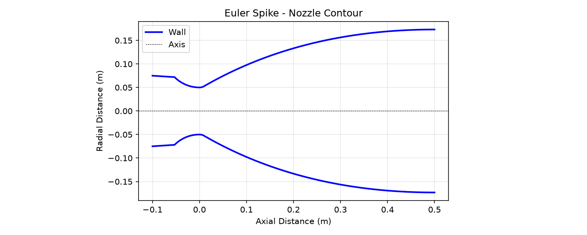

# Rocket Nozzle CFD

Compressible CFD analysis of converging-diverging (de Laval) rocket nozzles using SU2, with triple validation against isentropic theory and Method of Characteristics.

**Portfolio:** [ajeet-krish.github.io/rocket-nozzle-cfd](https://ajeet-krish.github.io/rocket-nozzle-cfd)
**GitHub:** [github.com/ajeet-krish/rocket-nozzle-cfd](https://github.com/ajeet-krish/rocket-nozzle-cfd)

## Overview

This project simulates compressible flow through a converging-diverging rocket nozzle using SU2 CFD. The pipeline generates a parametric Rao parabolic bell nozzle contour, creates a structured O-grid mesh with Gmsh, runs SU2 Euler and RANS simulations, and validates results against three independent methods:

1. **Isentropic analytical relations** (closed-form equations)
2. **Method of Characteristics** (classical supersonic design method)
3. **SU2 CFD** (finite-volume Euler/RANS solver)

The project sweeps expansion ratio (4-20), chamber pressure (5-50 MPa), and throat radius (0.01-0.1 m) to build an aerodynamic database of nozzle configurations.

## Results

### Reference Case

| Parameter | Value |
|-----------|-------|
| Expansion ratio (Ae/At) | 16 |
| Chamber pressure (Pc) | 9.7 MPa |
| Throat radius (R*) | 0.05 m |
| Chamber temperature (T0) | 3600 K |
| Gas | Air (gamma=1.4, R=287.058 J/(kg*K)) |
| Isentropic exit Mach | 4.4593 |

### Validation Summary

| Method | Exit Mach | Error | Status |
|--------|-----------|-------|--------|
| Isentropic (analytical) | 4.4593 | - | Reference |
| MoC (1D) | 4.4593 | 0.00% | Reference |
| SU2 Euler (60x30) | 4.4927 | 0.75% | PASSED |
| SU2 RANS SST (40x30) | 4.1017 | 8.7% vs Euler | Converged |

### Triple Validation

| Comparison | Error | Tolerance | Status |
|------------|-------|-----------|--------|
| SU2 vs Isentropic | 0.75% | < 5% | PASSED |
| SU2 vs MoC | 0.75% | < 5% | PASSED |
| Isentropic vs MoC | 0.00% | < 5% | PASSED |
| **Max pairwise error** | **0.75%** | < 5% | **PASSED** |

### Grid Convergence Index (GCI)

| Mesh Level | Cells | Exit Mach | GCI |
|------------|-------|-----------|-----|
| Coarse | 450 | 4.0399 | - |
| Medium | 1,800 | 4.4927 | - |
| Fine | 7,200 | 4.7875 | 0.687% |
| **Extrapolated** | - | **5.3372** | - |

- Apparent order: 0.62
- Asymptotic ratio: 1.00
- **Status: PASSED**

### Euler vs RANS Comparison

| Metric | Euler (Inviscid) | RANS SST (Viscous) | Difference |
|--------|------------------|---------------------|------------|
| Exit Mach | 4.4927 | 4.1017 | 8.70% |
| Boundary Layer | None | Resolved | - |
| Wall Treatment | Slip | No-slip, adiabatic | - |

## Visualizations

<!-- REPLACE: Use ParaView to create Mach contour with nozzle wall overlay -->
<!-- See docs/PARAVIEW_GUIDE.md for instructions -->
### Mach Number Contour (ParaView)

> ParaView screenshot of Euler Mach contour with nozzle wireframe overlay. Shows flow acceleration from subsonic inlet through sonic throat to supersonic exit.

<!-- REPLACE: Use ParaView to create pressure contour -->
### Pressure Contour (ParaView)

> ParaView screenshot of static pressure distribution. Blue = low pressure (exit), Red = high pressure (chamber).

<!-- REPLACE: Use ParaView to create shock diamond visualization -->
### Shock Diamonds (ParaView)

> ParaView screenshot using Gradient Of Unstructured Data filter on density. Shows compression and expansion waves in exhaust plume.

### Convergence History (matplotlib)

> RMS density residual drops 6+ orders of magnitude, confirming steady-state convergence.

<!-- REPLACE: Use ParaView to create Euler vs RANS side-by-side -->
### Euler vs RANS Comparison (ParaView)

> Side-by-side ParaView screenshots showing inviscid (Euler) vs viscous (RANS SST) Mach contours.

### Nozzle Geometry (matplotlib)

> Rao parabolic bell nozzle contour with 6 control points for accurate curve representation.

### Parametric Sweep: Exit Mach vs Expansion Ratio (matplotlib)

> Exit Mach increases with expansion ratio following the isentropic area-Mach relation. SU2 results match isentropic theory within 5%.

### Parametric Sweep: Exit Mach vs Chamber Pressure (matplotlib)

> For calorically perfect gas (constant gamma), exit Mach is independent of chamber pressure. SU2 results confirm this theoretical prediction.

### Parametric Sweep: Exit Mach vs Throat Radius (matplotlib)

> Exit Mach is independent of absolute scale for geometrically similar nozzles.

## Methodology

### Nozzle Geometry

The nozzle contour uses a Rao parabolic bell approximation (Sutton & Biblarz, "Rocket Propulsion Elements"). The diverging section is a quadratic Bezier curve with:
- Throat wall angle: 30 degrees
- Exit wall angle: 0 degrees (parallel to axis)
- 80% of ideal bell length
- 6 control points for accurate curve representation

### Mesh Generation

Structured O-grid mesh generated using Gmsh transfinite meshing:
- Single-surface mesh with spline wall curve
- 60x30 cells (1,800 elements) for Euler validation
- 40x30 cells (1,200 elements) for RANS
- 40x20 cells (800 elements) for parametric sweeps

### CFD Solver

**Euler (inviscid):**
- SOLVER= EULER, AXISYMMETRIC= YES
- ROE flux scheme, first-order (MUSCL=NO)
- CFL=0.1 with adaptation (max 20), 5000 iterations
- Inlet: total conditions (Pc=9.7 MPa, T0=3600K)
- Outlet: static pressure (101325 Pa)

**RANS (viscous):**
- SOLVER= RANS, KIND_TURB_MODEL= SST
- Freestream: ambient conditions (101325 Pa, 300K)
- Inlet BC drives the flow through the nozzle
- Adiabatic wall boundary conditions

### Validation

Triple validation methodology:
1. **Isentropic relations**: Closed-form area-Mach relation, pressure/temperature ratios
2. **Method of Characteristics**: 1D approximation using isentropic area-Mach at each contour point
3. **SU2 CFD**: Finite-volume Euler/RANS with ROE scheme

Grid Convergence Index (GCI) per ASME V&V 20-2009:
- 3 mesh levels: coarse (450), medium (1800), fine (7200 cells)
- Refinement ratio: r=2
- Safety factor: Fs=1.25

### Parametric Sweeps

| Sweep | Parameter | Values | Fixed Parameters |
|-------|-----------|--------|-----------------|
| 1 | Expansion ratio | 4, 8, 12, 16, 20 | Pc=9.7 MPa, R*=0.05m |
| 2 | Chamber pressure | 5, 10, 20, 50 MPa | epsilon=12, R*=0.05m |
| 3 | Throat radius | 0.01, 0.025, 0.05, 0.1 m | epsilon=12, Pc=9.7 MPa |

## Project Structure

```
rocket-nozzle-cfd/
  pyproject.toml              # uv managed, Python >=3.13
  src/
    nozzle/                   # Geometry generation
      config.py               # NozzleConfig dataclass (v2)
      geometry.py             # Rao bell contour (Bezier)
      presets.py              # Engine presets (Merlin 1D, Raptor)
    cfd/                      # SU2 mesh and solver
      config.py               # SU2NozzleConfig (v8.4.0)
      mesh.py                 # Gmsh O-grid generator
      mesh_config.py          # MeshConfig (zone-based)
      rans_config.py          # SU2RANSConfig (SST)
      solver.py               # SU2 subprocess runner
      vtu_parser.py           # Binary VTU parser (v8.4.0)
    validation/               # Analytical validation
      isentropic.py           # Isentropic relations
      moc_solver.py           # Method of Characteristics
      triple.py               # 3-way comparison
      gci.py                  # Grid Convergence Index
    sweep/                    # Parametric sweeps
      config.py               # SweepConfig
      runner.py               # Sweep orchestration
      plotter.py              # Parametric plots
    viz/                      # Visualization
      postprocessing.py       # Wall pressure, shock diamonds
      mach_contour.py         # Mach contour (tricontourf)
      comparison.py           # Euler vs RANS plots
  tests/                      # 287 tests
  docs/                       # Portfolio HTML site
    PARAVIEW_GUIDE.md         # ParaView visualization guide
  run_euler_spike.py          # Quick convergence test
  run_euler.py                # Full Euler simulation
  run_rans.py                 # RANS SST simulation
  run_postprocess.py          # Post-processing plots
  run_validation.py           # Triple validation + GCI
  run_sweeps.py               # Parametric sweeps
  run_all.py                  # Run everything in sequence
```

## Technology Stack

| Component | Choice | Rationale |
|-----------|--------|-----------|
| Solver | SU2 v8.4.0 | Compressible flow, axisymmetric flag |
| Mesh | Gmsh structured O-grid | Body-fitted, shock-aligned, native .su2 export |
| Contour | Rao parabolic bell (Sutton & Biblarz) | Industry standard nozzle design |
| Post-processing | ParaView + matplotlib | ParaView for VTU contours, matplotlib for 1D plots |
| Portfolio | Static HTML (AK-Vortex theme) | Consistent with existing portfolio |
| Testing | pytest (287 tests) | Comprehensive validation coverage |

## How to Run

```bash
# Install dependencies
uv sync

# Quick convergence test (~2 min)
uv run python run_euler_spike.py

# Full Euler simulation (~10 min)
uv run python run_euler.py

# RANS simulation (requires Euler first)
uv run python run_rans.py

# Post-processing (requires Euler + RANS)
uv run python run_postprocess.py

# Triple validation + GCI study
uv run python run_validation.py

# Parametric sweeps
uv run python run_sweeps.py

# Run everything in sequence
uv run python run_all.py

# Run all tests
uv run pytest tests/ -v
```

## ParaView Guide

For publication-quality visualizations, use ParaView to create contour plots from VTU files. See [docs/PARAVIEW_GUIDE.md](docs/PARAVIEW_GUIDE.md) for detailed instructions.

**Quick start:**
1. Open `output/euler/flow.vtu` in ParaView
2. Coloring -> Mach, Colormap -> Jet
3. File -> Open -> `output/euler/nozzle.su2` -> Representation -> Wireframe (black, width 3)
4. File -> Save Screenshot -> `docs/assets/images/mach_contour_paraview.png`

## References

- Anderson, J.D. "Modern Compressible Flow" (isentropic relations)
- Sutton, G.P. & Biblarz, O. "Rocket Propulsion Elements" (nozzle design)
- Shapiro, A.H. "The Dynamics and Thermodynamics of Compressible Fluid Flow" (MoC)
- Roache, P.J. "Verification and Validation in Computational Science" (GCI)
- ASME V&V 20-2009 (Grid Convergence Index standard)
- SU2 Documentation: https://su2code.github.io/
