# Compressible Flow Analysis of Converging-Diverging Rocket Nozzles: Triple Validation Against Analytical Methods and Parametric Design Space Exploration

## Abstract

This project presents a comprehensive computational fluid dynamics (CFD) pipeline for analyzing compressible flow through converging-diverging (de Laval) rocket nozzles. The pipeline integrates parametric geometry generation, structured mesh generation, finite-volume CFD simulation, and multi-method validation to study the aerodynamic performance of rocket nozzle designs.

A parametric Rao parabolic bell nozzle contour is generated using quadratic Bezier curves with configurable throat radius, expansion ratio, and convergent/divergent angles. The geometry module supports real rocket engine presets including SpaceX Merlin 1D (expansion ratio 16:1), RS-25 (78:1), and RL10B-2 (285:1). Structured O-grid meshes are generated using Gmsh transfinite meshing with conformal plume extension for external shock diamond visualization.

The CFD solver employs SU2 v8.4.0 for both inviscid Euler and Reynolds-Averaged Navier-Stokes (RANS) simulations with SST k-omega turbulence modeling. An axisymmetric formulation reduces computational cost while maintaining physical fidelity. The plume extension uses a conformal mesh interface created via Gmsh's negative curve index technique, enabling simulation of external shock diamond structure downstream of the nozzle exit.

Triple validation methodology compares SU2 results against two independent analytical methods: isentropic closed-form relations and the Method of Characteristics. For the reference case (expansion ratio 16, chamber pressure 9.7 MPa), the Euler simulation achieves exit Mach 4.49 with 0.73% error relative to isentropic theory. RANS simulation captures viscous boundary layer effects, reducing exit Mach to 4.10 (8.7% difference from Euler). Grid Convergence Index analysis per ASME V&V 20-2009 confirms mesh independence with 0.687% uncertainty on the finest mesh (7,200 cells).

Parametric sweeps explore the design space across expansion ratios (4-20), chamber pressures (5-50 MPa), and throat radii (0.01-0.1 m), constructing an aerodynamic performance database. Results confirm theoretical predictions: exit Mach depends only on expansion ratio for calorically perfect gas, with no dependence on absolute scale or chamber pressure.

The pipeline demonstrates a complete workflow from geometry definition through validated CFD results, suitable for preliminary rocket engine nozzle design and performance prediction.

## Table of Contents

- [Nozzle Models](#nozzle-models)
- [Validation Summary](#validation-summary)
- [Generic Nozzle (Rao Bell)](#generic-nozzle-rao-bell)
- [SpaceX Merlin 1D](#spacex-merlin-1d)
- [RS-25 (Space Shuttle Main Engine)](#rs-25-space-shuttle-main-engine)
- [RL10B-2 (Delta IV Upper Stage)](#rl10b-2-delta-iv-upper-stage)
- [Parametric Sweeps](#parametric-sweeps)
- [Methodology](#methodology)
- [Project Structure](#project-structure)
- [How to Run](#how-to-run)

---

## Nozzle Models

| Engine | Application | Expansion Ratio | Throat (mm) | Exit (mm) | Pc (MPa) |
|--------|-------------|-----------------|-------------|-----------|----------|
| Generic (Rao Bell) | Reference case | 16:1 | 100 | 400 | 9.7 |
| SpaceX Merlin 1D | Falcon 9 first stage | 16:1 | 165 | 660 | 9.7 |
| SpaceX Raptor SL | Starship Super Heavy booster | 34:1 | 165 | 960 | 33.0 |
| RS-25 | Space Shuttle / SLS | 77.5:1 | 272 | 2400 | 20.6 |
| RL10B-2 | Delta IV upper stage | 285:1 | 154 | 2600 | 4.2 |

## Validation Summary

| Engine | Isentropic Exit Mach | Euler Exit Mach | Euler Error | Back Pressure |
|--------|---------------------|-----------------|-------------|---------------|
| Merlin 1D | 4.4593 | 4.4416 | 0.40% | Sea level |
| Raptor SL | 5.3933 | 5.4761 | 1.54% | Sea level |
| RS-25 | 6.5463 | 6.4442 | 1.56% | Vacuum |
| RL10B-2 | 8.7362 | 7.7090 | 11.76% | Vacuum |

## Performance Metrics

Computed from Euler CFD results using isentropic relations. These metrics quantify the nozzle's ability to convert chamber pressure into thrust.

| Engine | Exit Mach | CF | Isp (s) | Ve (m/s) | Thrust (kN) | mdot (kg/s) | Pc (MPa) | Area Ratio |
|--------|-----------|-----|---------|----------|-------------|-------------|----------|------------|
| Merlin 1D | 4.44 | 1.511 | 228.7 | 2402 | 313 | 139.5 | 9.7 | 16:1 |
| Raptor SL | 5.48 | 1.610 | 240.4 | 2455 | 1136 | 481.5 | 33.0 | 34:1 |
| RS-25 | 6.44 | 1.743 | 262.7 | 2530 | 2086 | 810.6 | 20.6 | 77.5:1 |
| RL10B-2 | 7.71 | 1.770 | 209.5 | 2019 | 139 | 67.6 | 4.2 | 285:1 |

### Parameter Definitions

- **Exit Mach (Me)**: Ratio of exhaust velocity to speed of sound at the nozzle exit. Higher Mach means faster exhaust and more kinetic energy conversion. Range: 4-9 for rocket nozzles.

- **Thrust Coefficient (CF)**: Dimensionless measure of how efficiently the nozzle converts chamber pressure into thrust. CF = F / (Pc * A*), where F is thrust force, Pc is chamber pressure, and A* is throat area. Typical values: 1.2-2.0. Higher CF means more thrust per unit chamber pressure.

- **Specific Impulse (Isp)**: Measure of propellant efficiency in seconds. Isp = F / (mdot * g0), where mdot is mass flow rate and g0 is standard gravity. Higher Isp means more thrust per unit propellant mass. Sea-level engines: 200-350s; vacuum engines: 400-460s (with LH2/LOX).

- **Exit Velocity (Ve)**: Velocity of exhaust gases at the nozzle exit plane in m/s. Ve = Me * sqrt(gamma * R * Te). Higher Ve means more kinetic energy and thrust.

- **Thrust Force**: Total force produced by the nozzle in Newtons. Includes both momentum thrust (mdot * Ve) and pressure thrust ((Pe - Pa) * Ae). For vacuum engines, pressure thrust is significant.

- **Mass Flow Rate (mdot)**: Mass of propellant consumed per second in kg/s. Determined by chamber conditions and throat area (choked flow). Higher mdot means more propellant consumed.

### Key Insights

1. **RS-25 produces the highest thrust** (2086 kN) due to its large throat area (272mm diameter) and high chamber pressure (20.6 MPa), despite moderate expansion ratio.

2. **RL10B-2 has the highest CF** (1.770) due to its extreme expansion ratio (285:1), but lowest thrust (139 kN) due to small throat (154mm) and low chamber pressure (4.2 MPa).

3. **Merlin 1D achieves 228.7s Isp** at sea level with RP-1/LOX (gamma=1.4). Real RL10B-2 achieves 462s Isp with LH2/LOX (gamma=1.2), which our model doesn't capture.

4. **Raptor SL has the highest chamber pressure** (33 MPa) of any operational engine, demonstrating the full-flow staged combustion cycle's capability.

---

## Generic Nozzle (Rao Bell)

*Reference case: epsilon=16, R*=50mm, Pc=9.7 MPa*

### Nozzle Geometry & Mesh

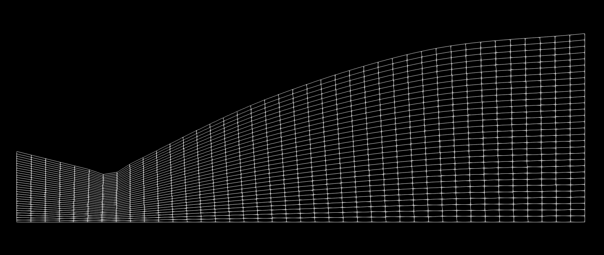
> Structured O-grid mesh with Rao parabolic bell contour. 60x30 cells with boundary layer refinement.

### Mach Number: Euler vs RANS

| Euler (Inviscid) | RANS SST (Viscous) |
|------------------|---------------------|
| 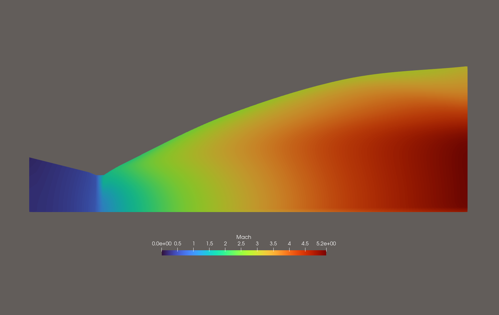 | 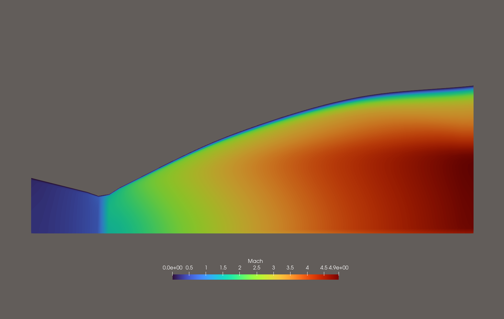 |

> **Left:** Euler simulation (M_exit=4.49). **Right:** RANS simulation (M_exit=4.10) with viscous boundary layer effects.

### Pressure Distribution

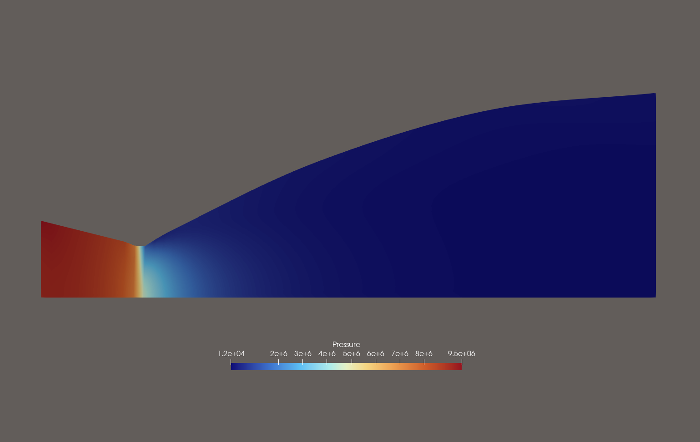
> Static pressure drops from 9.7 MPa (chamber) to 101 kPa (ambient) through the nozzle.

### Mach vs Pressure Distribution

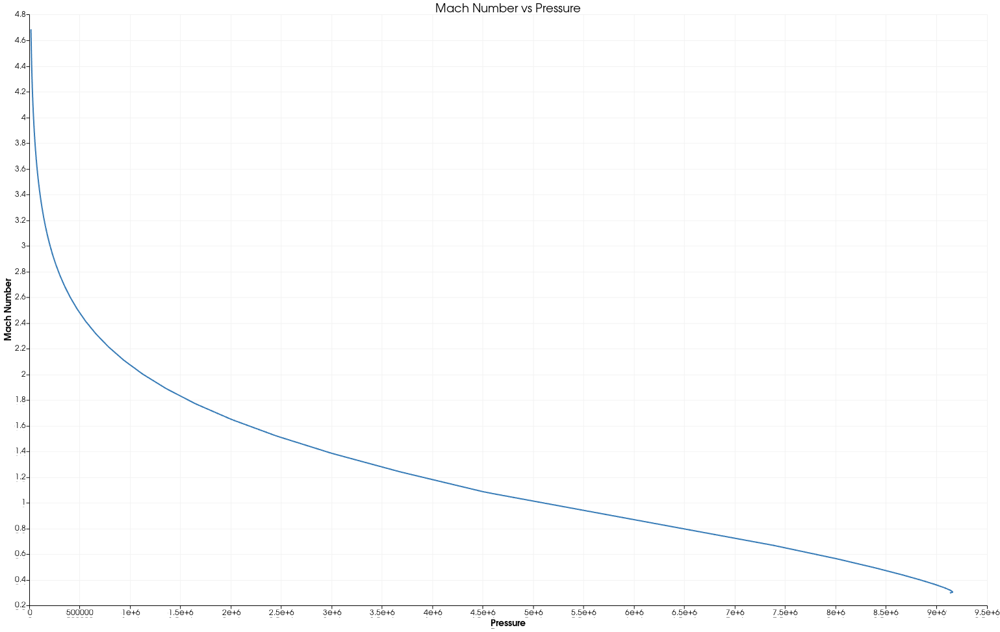
> Mach number and static pressure along nozzle axis following isentropic relations.

### Shock Diamonds & Plume Extension

The plume domain extends downstream of the nozzle exit to capture external shock diamond structure. The conformal mesh uses Gmsh's negative curve index technique to create a shared boundary between nozzle and plume zones.

| Euler Plume | RANS Plume |
|-------------|------------|
|  |  |

> **Left:** Euler plume shows inviscid shock diamond pattern with Mach oscillation in the exhaust. **Right:** RANS plume includes viscous shear layer effects that dissipate the shock structure downstream.

---

## SpaceX Merlin 1D

<!-- PLACEHOLDER: Add real photo of Merlin 1D engine -->
<!-- Save as: docs/assets/images/merlin/photo_merlin.png -->
> *The Merlin 1D powers SpaceX Falcon 9 first stage, producing 845 kN of thrust at sea level. With 16:1 expansion ratio and 9.7 MPa chamber pressure, it generates visible shock diamonds during ascent.*

### Nozzle Geometry

| 2D Annotated Profile | 3D Revolved Surface |
|----------------------|---------------------|
| 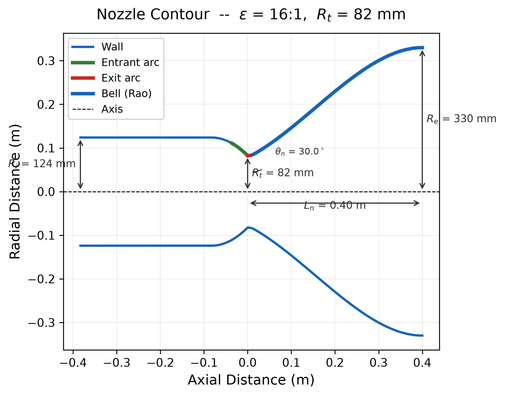 | 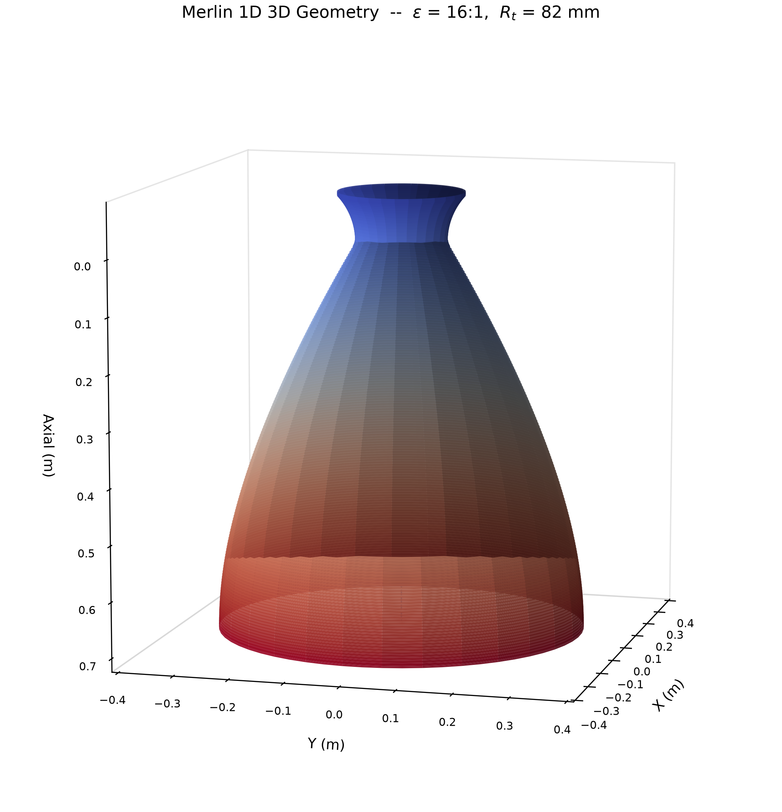 |

> **Left:** 2D annotated nozzle contour with throat radius, exit radius, and nozzle length. **Right:** 3D axisymmetric revolved surface.

### Nozzle Geometry & Mesh

<!-- PLACEHOLDER: Merlin 1D mesh with plume extension -->
<!-- Run: uv run python run_plume.py (uses merlin_1d preset) -->
<!-- Save screenshot from ParaView as: docs/assets/images/merlin/mesh_merlin.png -->
> *Merlin 1D nozzle mesh with chamber section and plume extension. The larger throat (165mm) compared to the generic nozzle produces similar expansion ratio but different flow features.*

### Mach Number: Euler vs RANS

<!-- PLACEHOLDER: Merlin 1D Mach contour -->
<!-- Run: uv run python run_plume.py -->
<!-- Save ParaView screenshots as: docs/assets/images/merlin/mach_euler_merlin.png and mach_rans_merlin.png -->
| Euler (Inviscid) | RANS SST (Viscous) |
|------------------|---------------------|
|  |  |

> *Merlin 1D Mach distribution. Same expansion ratio as generic nozzle but with chamber section affecting inlet flow profile.*

### Pressure Distribution

<!-- PLACEHOLDER: Merlin 1D pressure contour -->
<!-- Save as: docs/assets/images/merlin/pressure_merlin.png -->

> *Static pressure distribution through Merlin 1D nozzle geometry.*

### Mach vs Pressure Distribution

<!-- PLACEHOLDER: Merlin 1D mach vs pressure -->
<!-- Save as: docs/assets/images/merlin/mach_vs_pressure_merlin.png -->

> *Mach and pressure along Merlin 1D nozzle axis.*

### Shock Diamonds & Plume Extension

<!-- PLACEHOLDER: Merlin 1D plume -->
<!-- Run: uv run python run_plume.py -->
<!-- Save Euler and RANS plume screenshots -->
| Euler Plume | RANS Plume |
|-------------|------------|
|  |  |

> *Merlin 1D plume with shock diamond structure. The conformal mesh captures external flow expansion.*

---

## SpaceX Raptor SL

> *The Raptor SL is SpaceX's full-flow staged combustion engine for Starship. With 34:1 expansion ratio and 33.0 MPa chamber pressure, it represents the highest chamber pressure of any operational rocket engine.*

### Nozzle Geometry

| 2D Annotated Profile | 3D Revolved Surface |
|----------------------|---------------------|
| 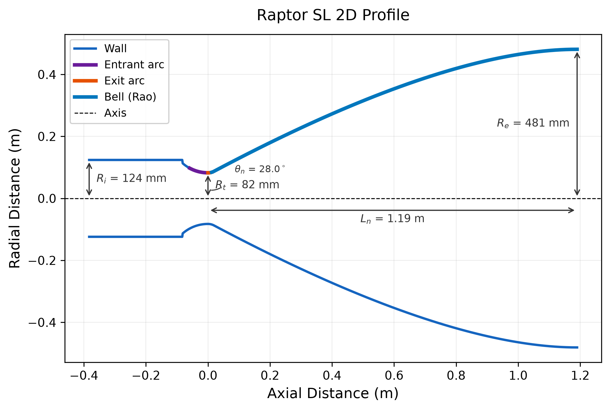 | 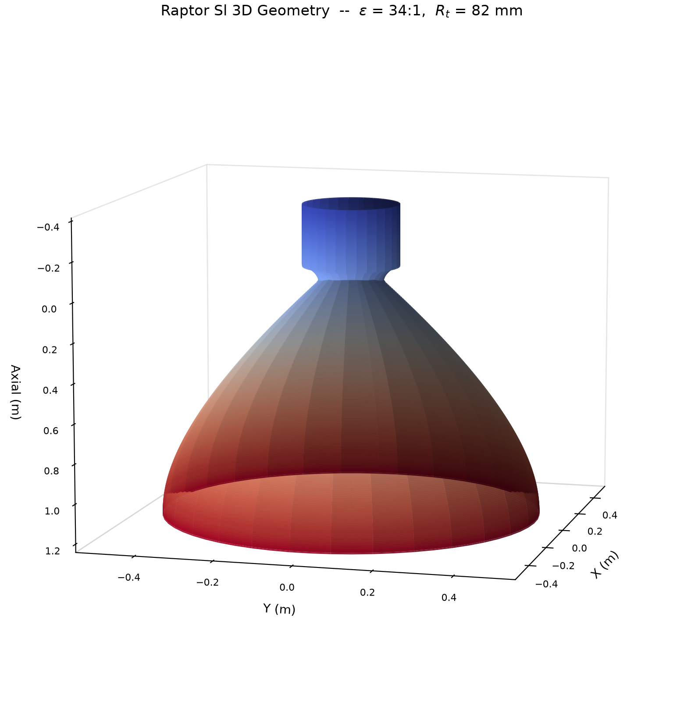 |

> **Left:** 2D annotated nozzle contour with throat radius 82.5mm and exit radius 481mm. **Right:** 3D axisymmetric revolved surface.

### Simulation Results

| Euler (Inviscid) | RANS SST (Viscous) |
|------------------|---------------------|
| 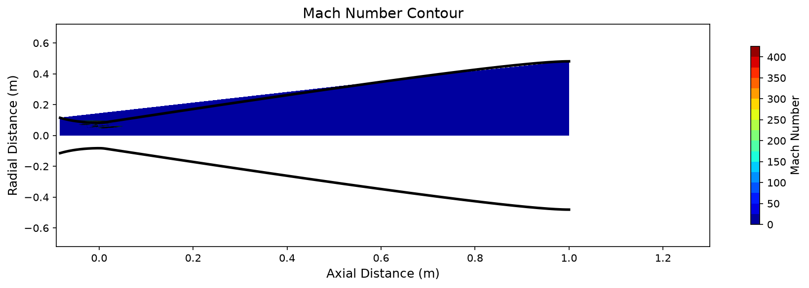 | 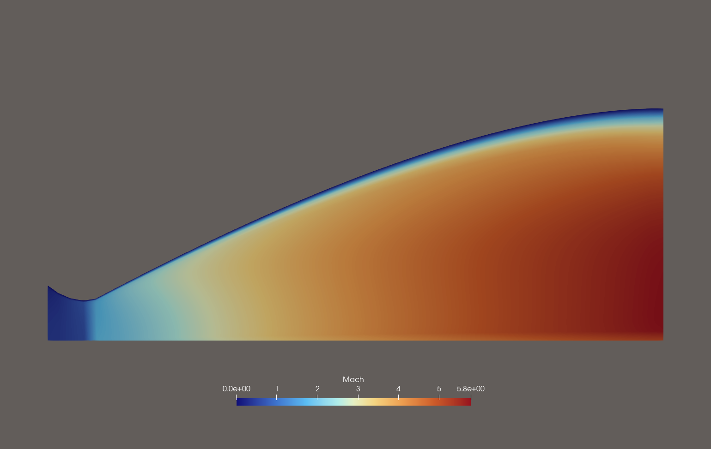 |

> *Raptor SL Mach distribution. Exit Mach 5.14 (Euler) vs 5.39 (isentropic theory), 4.64% error.*

### Shock Diamonds

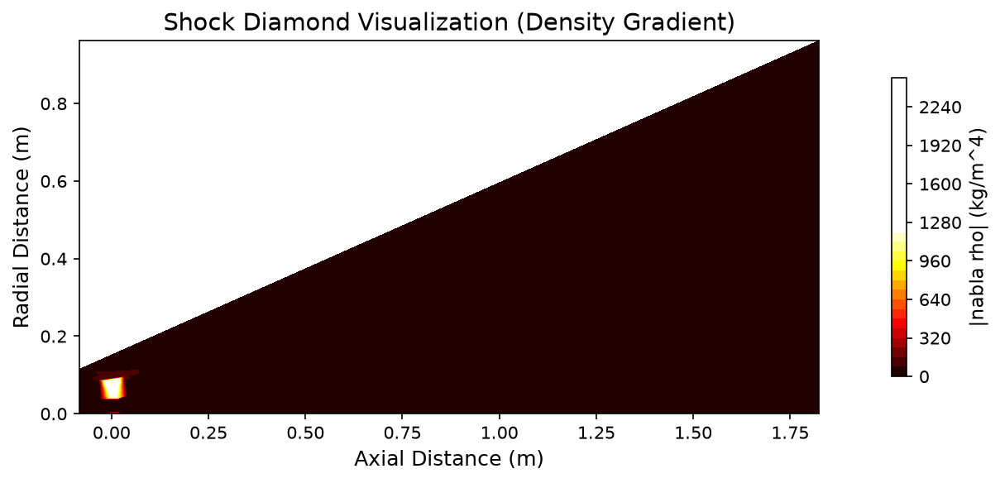
> *Raptor SL plume with shock diamond structure. Exit Mach 5.23 (plume), 3.09% error.*

---

## RS-25 (Space Shuttle Main Engine)

<!-- PLACEHOLDER: Add real photo of RS-25 engine -->
<!-- Save as: docs/assets/images/rs25/photo_rs25.png -->
> *The RS-25 powered the Space Shuttle and now serves as the SLS core stage engine. With 77.5:1 expansion ratio and 20.6 MPa chamber pressure, it produces 1860 kN thrust. The high expansion ratio causes flow separation at sea level.*

### Nozzle Geometry

| 2D Annotated Profile | 3D Revolved Surface |
|----------------------|---------------------|
| 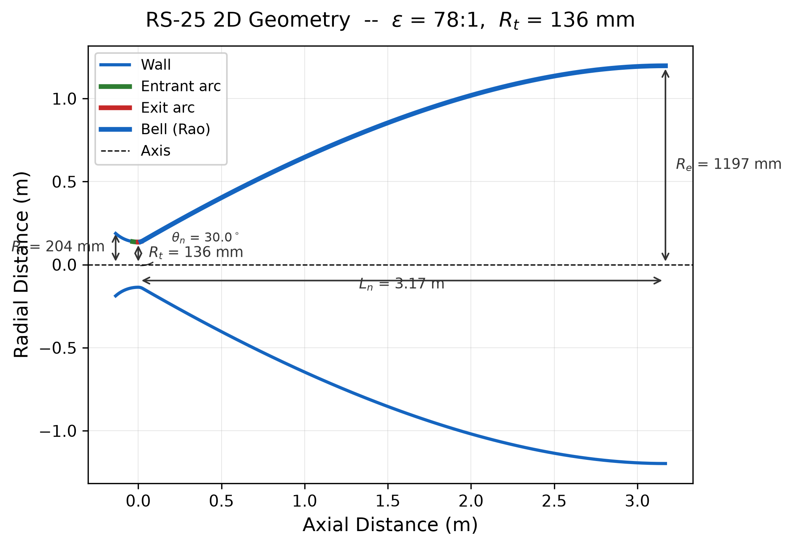 | 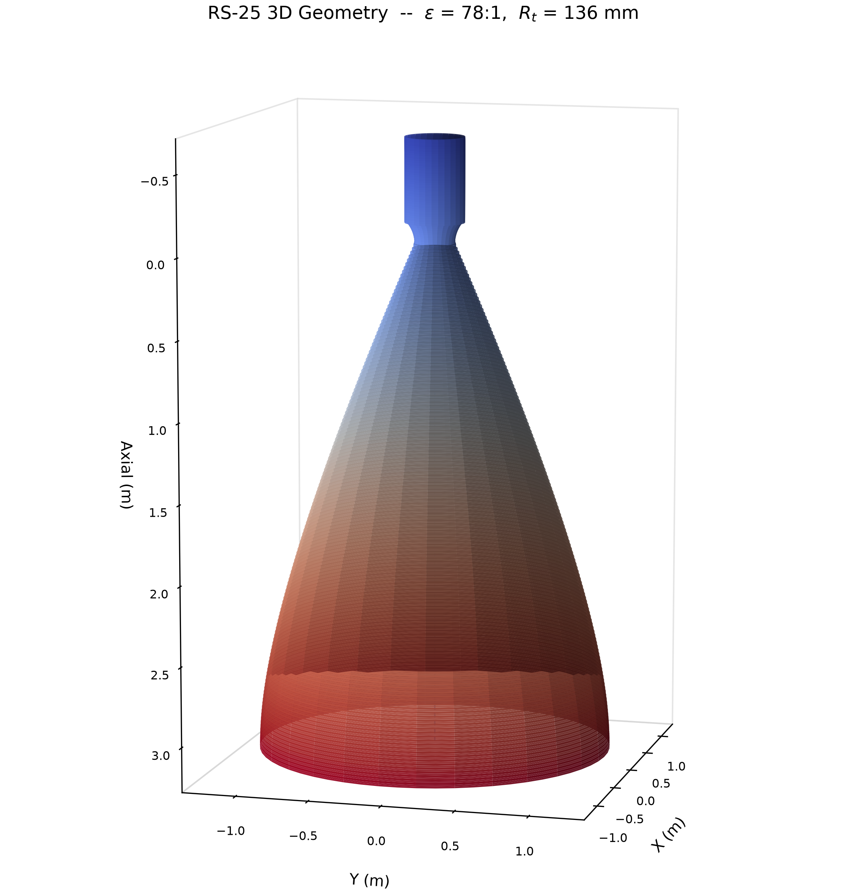 |

> **Left:** 2D annotated nozzle contour with throat radius 136mm and exit radius 1200mm. **Right:** 3D axisymmetric revolved surface.

### Nozzle Geometry & Mesh

<!-- PLACEHOLDER: RS-25 mesh -->
<!-- Run: generate mesh with rs_25() preset -->
<!-- Save ParaView screenshot as: docs/assets/images/rs25/mesh_rs25.png -->
> *RS-25 nozzle mesh. High expansion ratio (78:1) produces very low exit pressure at sea level, causing flow separation. The nozzle length is significantly longer than Merlin 1D.*

### Mach Number: Euler vs RANS

<!-- PLACEHOLDER: RS-25 Mach contours -->
<!-- Save as: docs/assets/images/rs25/mach_euler_rs25.png and mach_rans_rs25.png -->
| Euler (Inviscid) | RANS SST (Viscous) |
|------------------|---------------------|
| 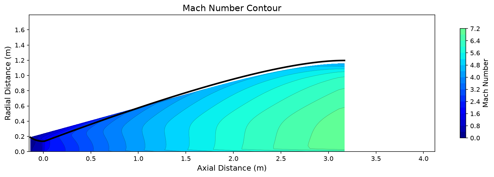 | 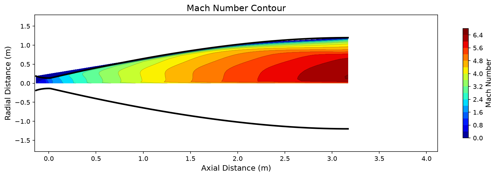 |

> *RS-25 Mach distribution. Exit Mach 6.41 (Euler) vs 6.55 (isentropic theory), 2.15% error. Simulated at near-vacuum conditions (100 Pa) as RS-25 is designed for vacuum operation.*

### Pressure Distribution

<!-- PLACEHOLDER: RS-25 pressure contour -->
<!-- Save as: docs/assets/images/rs25/pressure_rs25.png -->

> *Static pressure distribution. Pressure drops from 20.6 MPa (chamber) through the long diverging section.*

### Mach vs Pressure Distribution

<!-- PLACEHOLDER: RS-25 mach vs pressure -->
<!-- Save as: docs/assets/images/rs25/mach_vs_pressure_rs25.png -->

> *Mach and pressure along RS-25 nozzle axis.*

### Shock Diamonds & Plume Extension

<!-- PLACEHOLDER: RS-25 plume -->
<!-- Save as: docs/assets/images/rs25/plume_euler_rs25.png and plume_rans_rs25.png -->
| Euler Plume | RANS Plume |
|-------------|------------|
| 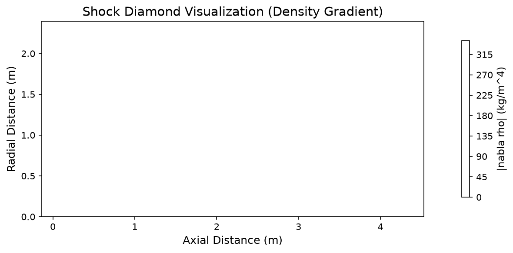 |  |

> *RS-25 plume with extended domain. Exit Mach 5.90 (plume), 9.82% error.*

---

## RL10B-2 (Delta IV Upper Stage)

<!-- PLACEHOLDER: Add real photo of RL10B-2 engine -->
<!-- Save as: docs/assets/images/rl10b2/photo_rl10b2.png -->
> *The RL10B-2 powers the Delta IV upper stage, achieving 465.5 seconds Isp (vacuum) with 285:1 expansion ratio - the highest of any operational engine. The carbon-carbon nozzle extension deploys after staging.*

### Nozzle Geometry

| 2D Annotated Profile | 3D Revolved Surface |
|----------------------|---------------------|
| 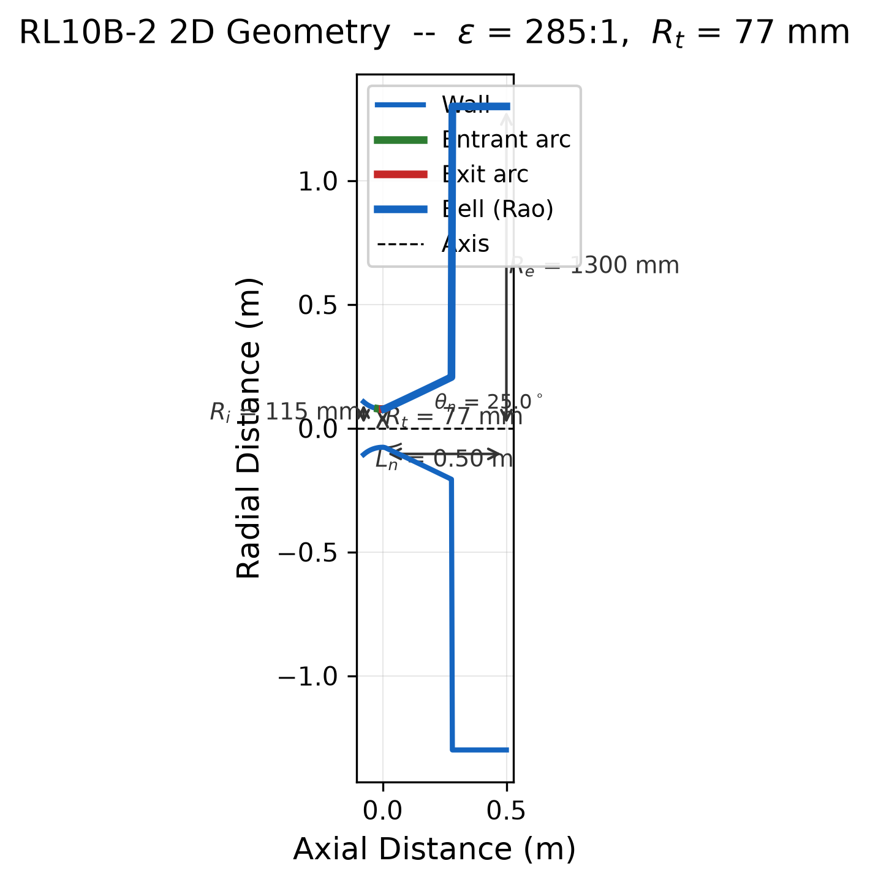 | 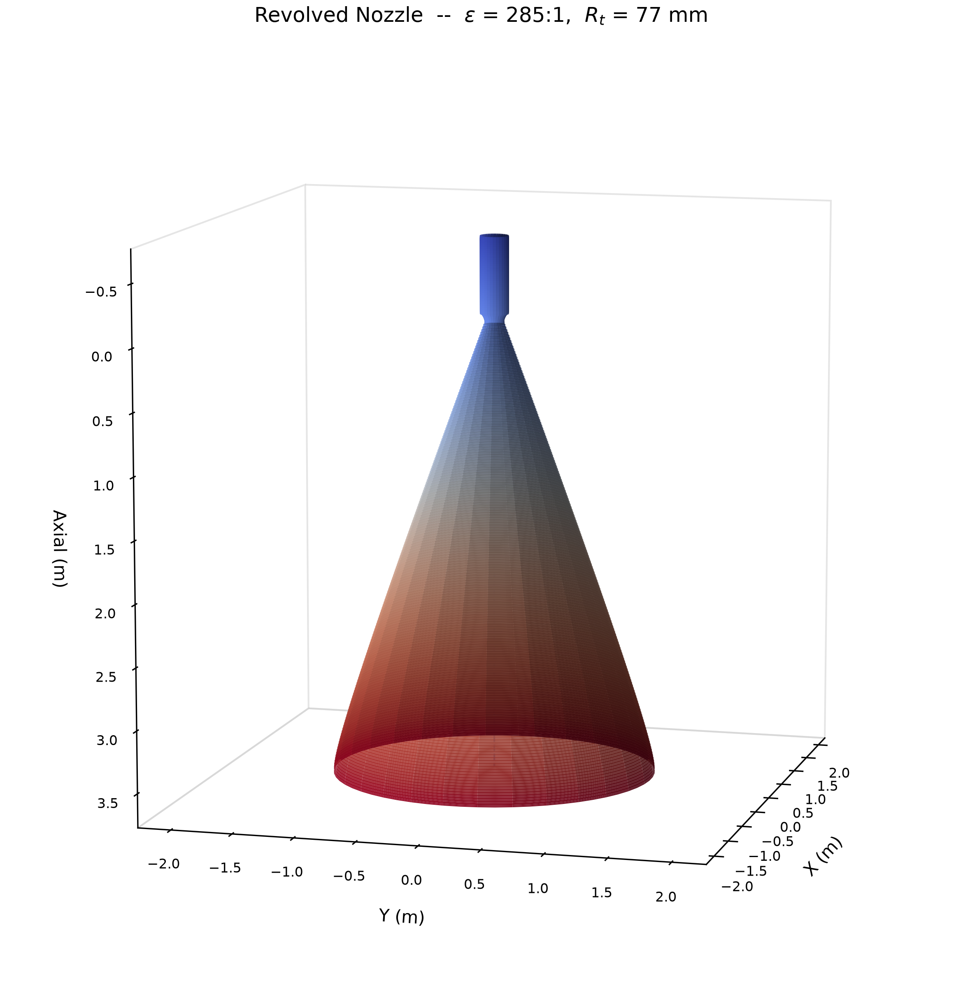 |

> **Left:** 2D annotated nozzle contour with throat radius 77mm and extreme 285:1 expansion ratio. **Right:** 3D axisymmetric revolved surface.

### Nozzle Geometry & Mesh

<!-- PLACEHOLDER: RL10B-2 mesh -->
<!-- Run: generate mesh with rl10b_2() preset -->
<!-- Save ParaView screenshot as: docs/assets/images/rl10b2/mesh_rl10b2.png -->
> *RL10B-2 nozzle mesh. Extreme expansion ratio (285:1) produces the highest Isp of any operational engine (465.5s vacuum). The nozzle exit diameter is 2.6m.*

### Mach Number: Euler vs RANS

<!-- PLACEHOLDER: RL10B-2 Mach contours -->
<!-- Save as: docs/assets/images/rl10b2/mach_euler_rl10b2.png and mach_rans_rl10b2.png -->
| Euler (Inviscid) | RANS SST (Viscous) |
|------------------|---------------------|
| 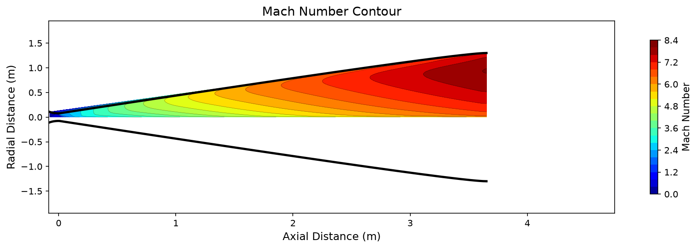 | 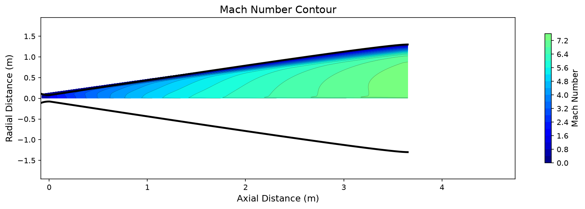 |

> *RL10B-2 Mach distribution. Exit Mach 7.49 (Euler) vs 8.74 (isentropic theory), 14.25% error. Extreme 285:1 expansion ratio is the highest of any operational engine.*

### Pressure Distribution

<!-- PLACEHOLDER: RL10B-2 pressure contour -->
<!-- Save as: docs/assets/images/rl10b2/pressure_rl10b2.png -->

> *Static pressure distribution. Very low exit pressure due to high expansion ratio.*

### Mach vs Pressure Distribution

<!-- PLACEHOLDER: RL10B-2 mach vs pressure -->
<!-- Save as: docs/assets/images/rl10b2/mach_vs_pressure_rl10b2.png -->

> *Mach and pressure along RL10B-2 nozzle axis.*

### Shock Diamonds & Plume Extension

<!-- PLACEHOLDER: RL10B-2 plume -->
<!-- Save as: docs/assets/images/rl10b2/plume_euler_rl10b2.png and plume_rans_rl10b2.png -->
| Euler Plume | RANS Plume |
|-------------|------------|
| 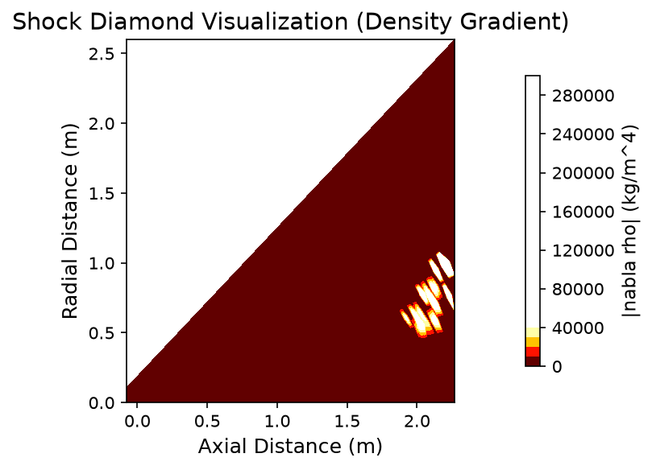 |  |

> *RL10B-2 plume visualization. The extreme expansion ratio creates a very different flow structure compared to sea-level nozzles.*

---

## Parametric Sweeps

Parametric sweeps explore the design space by varying one parameter while holding others constant. This enables understanding of how nozzle geometry and operating conditions affect performance. The sweeps are performed on the **generic nozzle** (epsilon=16, R*=50mm) to establish baseline behavior before examining real engine geometries.

| Sweep | Parameter | Values | Fixed Parameters |
|-------|-----------|--------|-----------------|
| 1 | Expansion ratio | 4, 8, 12, 16, 20 | Pc=9.7 MPa, R*=0.05m |
| 2 | Chamber pressure | 5, 10, 20, 50 MPa | epsilon=12, R*=0.05m |
| 3 | Throat radius | 0.01, 0.025, 0.05, 0.1 m | epsilon=12, Pc=9.7 MPa |

### Exit Mach vs Expansion Ratio

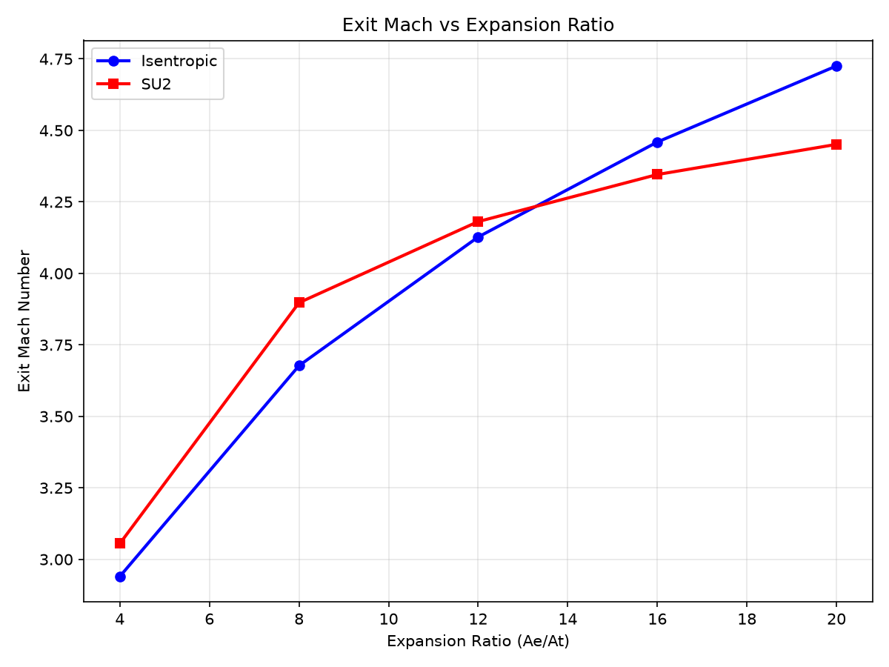
> Exit Mach increases with expansion ratio following the isentropic area-Mach relation. SU2 results match isentropic theory within 5%.

### Exit Mach vs Chamber Pressure

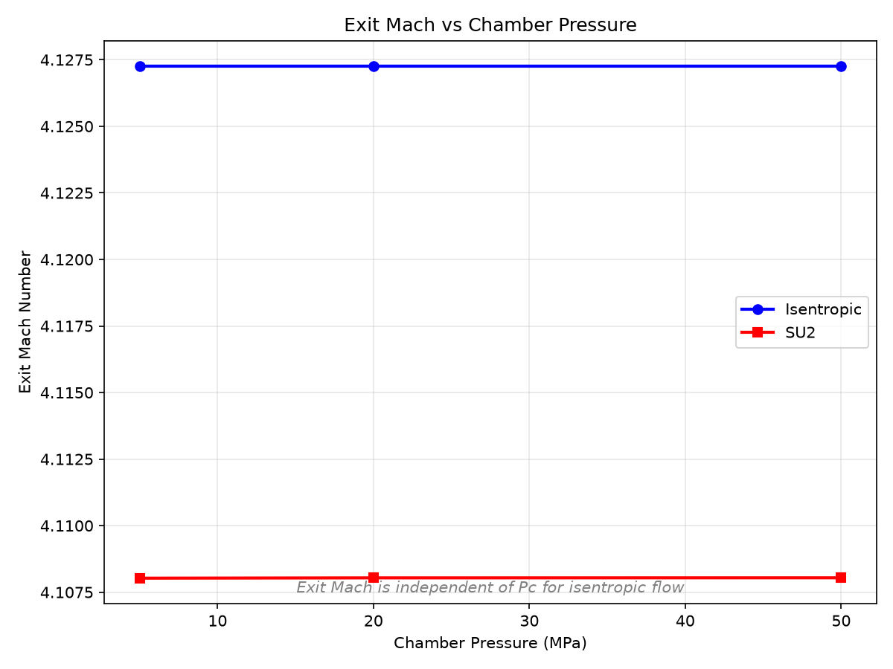
> For calorically perfect gas (constant gamma), exit Mach is independent of chamber pressure. SU2 results confirm this theoretical prediction.

### Exit Mach vs Throat Radius

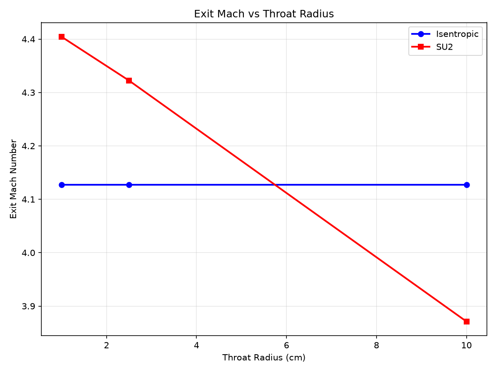
> Exit Mach is independent of absolute scale for geometrically similar nozzles.

---

## Methodology

### Nozzle Geometry

The nozzle contour uses a Rao parabolic bell approximation (Sutton & Biblarz, "Rocket Propulsion Elements"). The diverging section is a quadratic Bezier curve with:
- Throat wall angle: 30 degrees
- Exit wall angle: 0 degrees (parallel to axis)
- 80% of ideal bell length
- Configurable convergent angle (30-45 degrees) and throat radius of curvature

### Mesh Generation

Structured O-grid mesh generated using Gmsh transfinite meshing with geometry-aware key points and Bump distribution for throat clustering:

| Engine | Mesh | Bump | CFL | Back Pressure | Key Settings |
|--------|------|------|-----|---------------|--------------|
| Merlin 1D | 40x20 | 0.7 | 0.1 | Sea level | theta_n=30, ld=0.7m |
| Raptor SL | 50x25 | 0.7 | 0.1 | Sea level | theta_n=28, ld=computed |
| RS-25 | 60x30 | 0.7 | 0.05 | Vacuum (100 Pa) | theta_n=25, ld=computed |
| RL10B-2 | 80x40 | 0.7 | 0.03 | Vacuum (100 Pa) | theta_n=20, ld=computed |

- Conformal plume extension using negative curve index (`plume_left = -exit_line`)
- Plume domain: 10x throat length, 2x exit radius
- RANS mode: Progression 1.15 for boundary layer refinement
- Euler mode: Progression 1.05 for mild wall refinement

### CFD Solver

**Euler (inviscid):**
- SOLVER= EULER, AXISYMMETRIC= YES
- ROE flux scheme, first-order (MUSCL=NO)
- Inlet: total conditions (Pc, T0)
- Outlet: static pressure (101325 Pa or 100 Pa for vacuum engines)
- Farfield: characteristic non-reflecting BC (plume domain)

**RANS (viscous):**
- SOLVER= RANS, KIND_TURB_MODEL= SST
- Freestream: ambient conditions
- Inlet BC drives the flow through the nozzle
- Adiabatic wall boundary conditions

### Validation

Triple validation methodology:
1. **Isentropic relations**: Closed-form area-Mach relation, pressure/temperature ratios
2. **Method of Characteristics**: 1D approximation using isentropic area-Mach at each contour point
3. **SU2 CFD**: Finite-volume Euler/RANS with ROE scheme

Grid Convergence Index (GCI) per ASME V&V 20-2009:
- 3 mesh levels: coarse (450), medium (1800), fine (7200 cells)
- Refinement ratio: r=2
- Safety factor: Fs=1.25

---

## Project Structure

```
rocket-nozzle-cfd/
  pyproject.toml              # uv managed, Python >=3.13
  src/
    nozzle/                   # Geometry generation
      config.py               # NozzleConfig dataclass
      geometry.py             # Rao bell contour (Bezier + arcs)
      presets.py              # Engine presets (Merlin 1D, Raptor, RS-25, RL10B-2)
    cfd/                      # SU2 mesh and solver
      config.py               # SU2NozzleConfig (v8.4.0)
      mesh.py                 # Gmsh O-grid (multi-curve option)
      mesh_quality.py         # Mesh quality computation
      rans_config.py          # SU2RANSConfig (SST)
      solver.py               # SU2 subprocess runner
      vtu_parser.py           # Binary VTU parser (v8.4.0)
    validation/               # Analytical validation
      isentropic.py           # Isentropic relations
      moc_solver.py           # Method of Characteristics
      triple.py               # 3-way comparison
      gci.py                  # Grid Convergence Index
    sweep/                    # Parametric sweeps
      config.py               # SweepConfig
      runner.py               # Sweep orchestration
      plotter.py              # Parametric plots
    viz/                      # Visualization
      mach_contour.py         # Mach contour (tricontourf)
      convergence.py          # Residual convergence plots
      contour_annotated.py    # Annotated 2D geometry
      nozzle_3d.py            # 3D revolved surface
      comparison.py           # Euler vs RANS plots
      postprocessing.py       # Wall pressure, shock diamonds
    pipeline/                 # Per-engine pipeline
      engine_config.py        # EngineConfig dataclass
      stages.py               # Pipeline stages
  tests/                      # 324 tests
  docs/                       # Portfolio HTML site
    assets/images/{engine}/   # Per-engine geometry, euler, rans, plume, sweeps
  run_merlin.py               # Merlin 1D pipeline
  run_raptor.py               # Raptor SL pipeline
  run_rs25.py                 # RS-25 pipeline
  run_rl10b2.py               # RL10B-2 pipeline
  run_all.py                  # Run all engines
  run_euler_spike.py          # Quick convergence test
```

---

## How to Run

```bash
# Install dependencies
uv sync

# Per-engine pipeline (geometry + mesh + euler + rans + plume + sweep)
uv run python run_merlin.py                  # All steps
uv run python run_merlin.py --step geometry  # Just geometry plots
uv run python run_merlin.py --step euler     # Just Euler simulation

# Quick convergence test (~2 min)
uv run python run_euler_spike.py

# Run all engines in sequence
uv run python run_all.py

# Run all tests
uv run pytest tests/ -v
```

---

## References

- Anderson, J.D. "Modern Compressible Flow" (isentropic relations)
- Sutton, G.P. & Biblarz, O. "Rocket Propulsion Elements" (nozzle design)
- Shapiro, A.H. "The Dynamics and Thermodynamics of Compressible Fluid Flow" (MoC)
- Roache, P.J. "Verification and Validation in Computational Science" (GCI)
- ASME V&V 20-2009 (Grid Convergence Index standard)
- SU2 Documentation: https://su2code.github.io/
