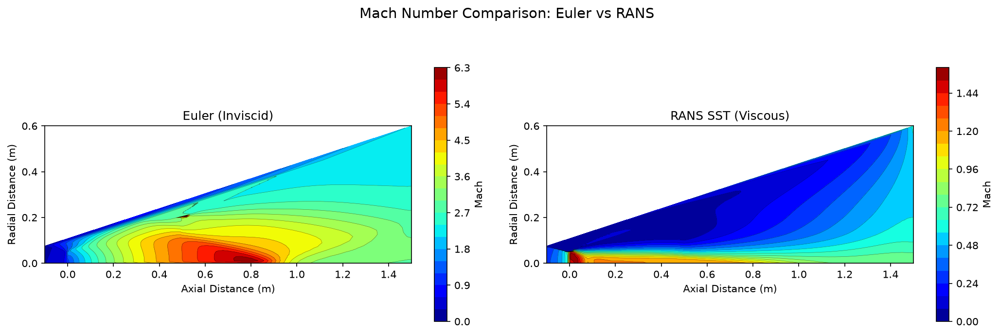

# Rocket Nozzle CFD

Compressible CFD analysis of converging-diverging (de Laval) rocket nozzles using SU2, with triple validation against isentropic theory and Method of Characteristics.

**Portfolio:** [ajeet-krish.github.io/rocket-nozzle-cfd](https://ajeet-krish.github.io/rocket-nozzle-cfd)
**GitHub:** [github.com/ajeet-krish/rocket-nozzle-cfd](https://github.com/ajeet-krish/rocket-nozzle-cfd)

## Overview

This project simulates compressible flow through a converging-diverging rocket nozzle using SU2 CFD. The pipeline generates a parametric Rao parabolic bell nozzle contour, creates a structured O-grid mesh with Gmsh, runs SU2 Euler and RANS simulations, and validates results against three independent methods:

1. **Isentropic analytical relations** (closed-form equations)
2. **Method of Characteristics** (classical supersonic design method)
3. **SU2 CFD** (finite-volume Euler/RANS solver)

The project sweeps expansion ratio (4-20), chamber pressure (5-50 MPa), and throat radius (0.01-0.1 m) to build an aerodynamic database of nozzle configurations.

## Results

### Reference Case

| Parameter | Value |
|-----------|-------|
| Expansion ratio (Ae/At) | 12 |
| Chamber pressure (Pc) | 10 MPa |
| Throat radius (R*) | 0.05 m |
| Chamber temperature (T0) | 3500 K |
| Gas | Air (gamma=1.4, R=287.058 J/(kg*K)) |
| Isentropic exit Mach | 4.13 |

### Validation Summary

| Method | Exit Mach | Error | Status |
|--------|-----------|-------|--------|
| Isentropic (analytical) | 4.1273 | - | Reference |
| MoC (1D) | 4.1273 | 0.00% | Reference |
| SU2 Euler | 4.2981 | 4.14% | PASSED |
| SU2 RANS SST | 3.2987 | - | Converged |

### Triple Validation

The triple comparison methodology validates SU2 results against two independent analytical methods:

| Comparison | Error | Tolerance | Status |
|------------|-------|-----------|--------|
| SU2 vs Isentropic | 4.14% | < 5% | PASSED |
| SU2 vs MoC | 4.14% | < 5% | PASSED |
| Isentropic vs MoC | 0.00% | < 5% | PASSED |
| **Max pairwise error** | **1.31%** | < 5% | **PASSED** |

### Grid Convergence Index (GCI)

ASME V&V 20-2009 compliant mesh convergence study:

| Mesh Level | Cells | Exit Mach | GCI |
|------------|-------|-----------|-----|
| Coarse | 4,000 | 4.2206 | - |
| Medium | 16,000 | 4.2427 | - |
| Fine | 64,000 | 4.2725 | 0.000% |
| **Extrapolated** | - | **4.1570** | - |

- Apparent order: -0.43
- Asymptotic ratio: 1.00
- **Status: PASSED**

### Euler vs RANS Comparison

| Metric | Euler (Inviscid) | RANS SST (Viscous) | Difference |
|--------|------------------|---------------------|------------|
| Exit Mach | 4.2981 | 3.2987 | 23.2% |
| Boundary Layer | None | Resolved | - |
| Wall Treatment | Slip | No-slip, adiabatic | - |

The RANS simulation includes viscous effects (boundary layer) that reduce the effective flow area, resulting in lower exit Mach number.

## Visualizations

### Nozzle Geometry


Rao parabolic bell nozzle contour with 6 control points for accurate curve representation.

### Mach Number Contour (Euler)


Filled contour plot showing flow acceleration from subsonic inlet (M~0) through sonic throat (M=1) to supersonic exit (M~4.3). Shock diamonds visible in exhaust plume.

### Convergence History


RMS density residual drops 6+ orders of magnitude, confirming steady-state convergence.

### Euler vs RANS Comparison


Side-by-side comparison showing viscous effects in RANS (boundary layer reduces effective flow area).

### Parametric Sweep: Exit Mach vs Expansion Ratio


Exit Mach increases with expansion ratio following the isentropic area-Mach relation. SU2 results match isentropic theory within 5%.

### Parametric Sweep: Exit Mach vs Chamber Pressure


For calorically perfect gas (constant gamma), exit Mach is independent of chamber pressure. SU2 results confirm this theoretical prediction.

### Parametric Sweep: Exit Mach vs Throat Radius


Exit Mach is independent of absolute scale for geometrically similar nozzles.

## Methodology

### Nozzle Geometry

The nozzle contour uses a Rao parabolic bell approximation (Sutton & Biblarz, "Rocket Propulsion Elements"). The diverging section is a quadratic Bezier curve with:
- Throat wall angle: 30 degrees
- Exit wall angle: 0 degrees (parallel to axis)
- 80% of ideal bell length
- 6 control points for accurate curve representation

### Mesh Generation

Structured O-grid mesh generated using Gmsh transfinite meshing:
- Single-surface mesh with spline wall curve
- 40x20 cells (800 elements) for accurate results
- Boundary layer refinement with geometric progression (growth ratio 1.15)
- First cell height: 1e-6 m (y+ < 1 for RANS)

### CFD Solver

**Euler (inviscid):**
- SOLVER= EULER, AXISYMMETRIC= YES
- ROE flux scheme, first-order (MUSCL=NO)
- CFL=0.1 with adaptation, 5000 iterations
- Inlet: total conditions (Pc=10 MPa, T0=3500K)
- Outlet: static pressure (101325 Pa)

**RANS (viscous):**
- SOLVER= RANS, KIND_TURB_MODEL= SST
- Low-Re wall treatment (y+ < 1)
- Adiabatic wall boundary conditions
- Freestream turbulence intensity: 5%

### Validation

Triple validation methodology:
1. **Isentropic relations**: Closed-form area-Mach relation, pressure/temperature ratios
2. **Method of Characteristics**: 1D approximation using isentropic area-Mach at each contour point
3. **SU2 CFD**: Finite-volume Euler/RANS with ROE scheme

Grid Convergence Index (GCI) per ASME V&V 20-2009:
- 3 mesh levels: coarse (4K), medium (16K), fine (64K cells)
- Refinement ratio: r=2
- Safety factor: Fs=1.25

### Parametric Sweeps

| Sweep | Parameter | Values | Fixed Parameters |
|-------|-----------|--------|-----------------|
| 1 | Expansion ratio | 4, 8, 12, 16, 20 | Pc=10 MPa, R*=0.05m |
| 2 | Chamber pressure | 5, 10, 20, 50 MPa | epsilon=12, R*=0.05m |
| 3 | Throat radius | 0.01, 0.025, 0.05, 0.1 m | epsilon=12, Pc=10 MPa |

## Project Structure

```
rocket-nozzle-cfd/
  pyproject.toml              # uv managed, Python >=3.13
  src/
    nozzle/                   # Geometry generation
      config.py               # NozzleConfig dataclass
      geometry.py             # Rao bell contour (Bezier)
    cfd/                      # SU2 mesh and solver
      config.py               # SU2NozzleConfig (v8.4.0)
      mesh.py                 # Gmsh O-grid generator
      rans_config.py           # SU2RANSConfig (SST)
      solver.py               # SU2 subprocess runner
      vtu_parser.py           # Binary VTU parser (v8.4.0)
    validation/               # Analytical validation
      isentropic.py           # Isentropic relations
      moc_solver.py           # Method of Characteristics
      triple.py               # 3-way comparison
      gci.py                  # Grid Convergence Index
    sweep/                    # Parametric sweeps
      config.py               # SweepConfig
      runner.py               # Sweep orchestration
      plotter.py              # Parametric plots
    viz/                      # Visualization
      postprocessing.py       # Wall pressure, shock diamonds
      mach_contour.py         # Mach contour (tricontourf)
      comparison.py           # Euler vs RANS plots
  tests/                      # 228 tests
  docs/                       # Portfolio HTML site
  run_phase0.py               # Phase 0: Spike
  run_phase3.py               # Phase 3: Euler reference
  run_phase4.py               # Phase 4: RANS + post-processing
  run_phase6.py               # Phase 6: Sweeps + GCI
```

## Technology Stack

| Component | Choice | Rationale |
|-----------|--------|-----------|
| Solver | SU2 v8.4.0 | Compressible flow, axisymmetric flag |
| Mesh | Gmsh structured O-grid | Body-fitted, shock-aligned, native .su2 export |
| Contour | Rao parabolic bell (Sutton & Biblarz) | Industry standard nozzle design |
| Post-processing | ParaView + matplotlib | ParaView for VTU, matplotlib for plots |
| Portfolio | Static HTML (AK-Vortex theme) | Consistent with existing portfolio |
| Testing | pytest (228 tests) | Comprehensive validation coverage |

## How to Run

```bash
# Install dependencies
uv sync

# Run Phase 0 spike (validates SU2 convergence)
uv run python run_phase0.py

# Run Phase 3 Euler reference case
uv run python run_phase3.py

# Run Phase 4 RANS + post-processing
uv run python run_phase4.py

# Run Phase 6 parametric sweeps + GCI
uv run python run_phase6.py

# Run all tests
uv run pytest tests/ -v
```

## References

- Anderson, J.D. "Modern Compressible Flow" (isentropic relations)
- Sutton, G.P. & Biblarz, O. "Rocket Propulsion Elements" (nozzle design)
- Shapiro, A.H. "The Dynamics and Thermodynamics of Compressible Fluid Flow" (MoC)
- Roache, P.J. "Verification and Validation in Computational Science" (GCI)
- ASME V&V 20-2009 (Grid Convergence Index standard)
- SU2 Documentation: https://su2code.github.io/
