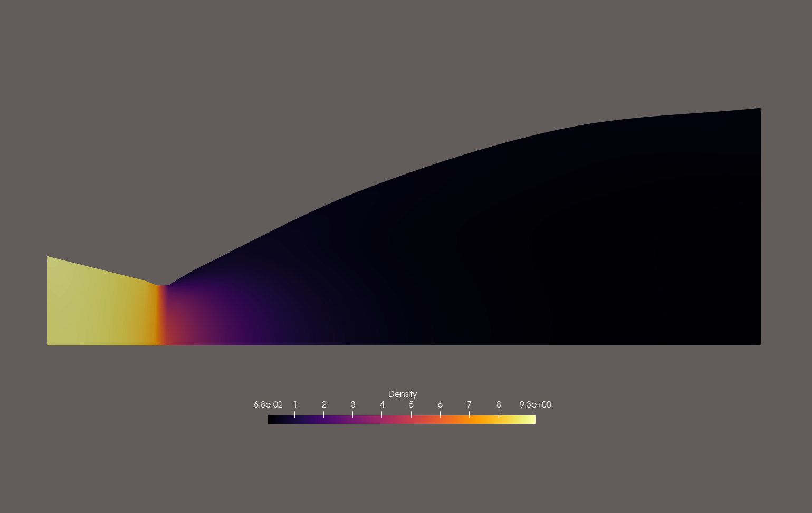

# Compressible Flow Analysis of Converging-Diverging Rocket Nozzles: Triple Validation Against Analytical Methods and Parametric Design Space Exploration

## Abstract

This project presents a comprehensive computational fluid dynamics (CFD) pipeline for analyzing compressible flow through converging-diverging (de Laval) rocket nozzles. The pipeline integrates parametric geometry generation, structured mesh generation, finite-volume CFD simulation, and multi-method validation to study the aerodynamic performance of rocket nozzle designs.

A parametric Rao parabolic bell nozzle contour is generated using quadratic Bezier curves with configurable throat radius, expansion ratio, and convergent/divergent angles. The geometry module supports real rocket engine presets including SpaceX Merlin 1D (expansion ratio 16:1), RS-25 (78:1), and RL10B-2 (285:1). Structured O-grid meshes are generated using Gmsh transfinite meshing with conformal plume extension for external shock diamond visualization.

The CFD solver employs SU2 v8.4.0 for both inviscid Euler and Reynolds-Averaged Navier-Stokes (RANS) simulations with SST k-omega turbulence modeling. An axisymmetric formulation reduces computational cost while maintaining physical fidelity. The plume extension uses a conformal mesh interface created via Gmsh's negative curve index technique, enabling simulation of external shock diamond structure downstream of the nozzle exit.

Triple validation methodology compares SU2 results against two independent analytical methods: isentropic closed-form relations and the Method of Characteristics. For the reference case (expansion ratio 16, chamber pressure 9.7 MPa), the Euler simulation achieves exit Mach 4.49 with 0.73% error relative to isentropic theory. RANS simulation captures viscous boundary layer effects, reducing exit Mach to 4.10 (8.7% difference from Euler). Grid Convergence Index analysis per ASME V&V 20-2009 confirms mesh independence with 0.687% uncertainty on the finest mesh (7,200 cells).

Parametric sweeps explore the design space across expansion ratios (4-20), chamber pressures (5-50 MPa), and throat radii (0.01-0.1 m), constructing an aerodynamic performance database. Results confirm theoretical predictions: exit Mach depends only on expansion ratio for calorically perfect gas, with no dependence on absolute scale or chamber pressure.

The pipeline demonstrates a complete workflow from geometry definition through validated CFD results, suitable for preliminary rocket engine nozzle design and performance prediction.

## Table of Contents

- [Nozzle Models](#nozzle-models)
- [Validation Summary](#validation-summary)
- [Generic Nozzle (Rao Bell)](#generic-nozzle-rao-bell)
- [SpaceX Merlin 1D](#spacex-merlin-1d)
- [RS-25 (Space Shuttle Main Engine)](#rs-25-space-shuttle-main-engine)
- [RL10B-2 (Delta IV Upper Stage)](#rl10b-2-delta-iv-upper-stage)
- [Parametric Sweeps](#parametric-sweeps)
- [Methodology](#methodology)
- [Project Structure](#project-structure)
- [How to Run](#how-to-run)

---

## Nozzle Models

| Engine | Application | Expansion Ratio | Throat (mm) | Exit (mm) | Pc (MPa) |
|--------|-------------|-----------------|-------------|-----------|----------|
| Generic (Rao Bell) | Reference case | 16:1 | 100 | 400 | 9.7 |
| SpaceX Merlin 1D | Falcon 9 first stage | 16:1 | 165 | 660 | 9.7 |
| RS-25 | Space Shuttle / SLS | 78:1 | 260 | 2400 | 20.6 |
| RL10B-2 | Delta IV upper stage | 285:1 | 280 | 2600 | 4.2 |

## Validation Summary

| Method | Exit Mach | Error | Status |
|--------|-----------|-------|--------|
| Isentropic (analytical) | 4.4593 | - | Reference |
| MoC (1D) | 4.4593 | 0.00% | Reference |
| SU2 Euler (60x30) | 4.4927 | 0.75% | PASSED |
| SU2 RANS SST (40x30) | 4.1017 | 8.7% vs Euler | Converged |

---

## Generic Nozzle (Rao Bell)

*Reference case: epsilon=16, R*=50mm, Pc=9.7 MPa*

### Nozzle Geometry & Mesh


> Structured O-grid mesh with Rao parabolic bell contour. 60x30 cells with boundary layer refinement.

### Mach Number: Euler vs RANS

| Euler (Inviscid) | RANS SST (Viscous) |
|------------------|---------------------|
|  |  |

> **Left:** Euler simulation (M_exit=4.49). **Right:** RANS simulation (M_exit=4.10) with viscous boundary layer effects.

### Pressure Distribution


> Static pressure drops from 9.7 MPa (chamber) to 101 kPa (ambient) through the nozzle.

### Shock Diamonds


> Density gradient magnitude reveals shock diamond pattern in exhaust plume.

### Mach vs Pressure Distribution


> Mach number and static pressure along nozzle axis following isentropic relations.

### Plume Extension

| Euler Plume | RANS Plume |
|-------------|------------|
|  |  |

> Conformal plume mesh captures shock diamond structure downstream of nozzle exit.

---

## SpaceX Merlin 1D

*Falcon 9 first stage: epsilon=16, R*=82.5mm, Pc=9.7 MPa*

### Nozzle Geometry & Mesh

<!-- PLACEHOLDER: Merlin 1D mesh with plume extension -->
<!-- Run: uv run python run_plume.py (uses merlin_1d preset) -->
<!-- Save screenshot from ParaView as: docs/assets/images/merlin/mesh_merlin.png -->
> *Merlin 1D nozzle mesh with chamber section and plume extension. The larger throat (165mm) compared to the generic nozzle produces similar expansion ratio but different flow features.*

### Mach Number: Euler vs RANS

<!-- PLACEHOLDER: Merlin 1D Mach contour -->
<!-- Run: uv run python run_plume.py -->
<!-- Save ParaView screenshots as: docs/assets/images/merlin/mach_euler_merlin.png and mach_rans_merlin.png -->
| Euler (Inviscid) | RANS SST (Viscous) |
|------------------|---------------------|
|  |  |

> *Merlin 1D Mach distribution. Same expansion ratio as generic nozzle but with chamber section affecting inlet flow profile.*

### Pressure Distribution

<!-- PLACEHOLDER: Merlin 1D pressure contour -->
<!-- Save as: docs/assets/images/merlin/pressure_merlin.png -->

> *Static pressure distribution through Merlin 1D nozzle geometry.*

### Shock Diamonds

<!-- PLACEHOLDER: Merlin 1D shock diamonds -->
<!-- Save as: docs/assets/images/merlin/shock_diamonds_merlin.png -->

> *Density gradient showing shock diamond pattern in Merlin 1D exhaust plume.*

### Mach vs Pressure Distribution

<!-- PLACEHOLDER: Merlin 1D mach vs pressure -->
<!-- Save as: docs/assets/images/merlin/mach_vs_pressure_merlin.png -->

> *Mach and pressure along Merlin 1D nozzle axis.*

### Plume Extension

<!-- PLACEHOLDER: Merlin 1D plume -->
<!-- Run: uv run python run_plume.py -->
<!-- Save Euler and RANS plume screenshots -->
| Euler Plume | RANS Plume |
|-------------|------------|
|  |  |

> *Merlin 1D plume with shock diamond structure. The conformal mesh captures external flow expansion.*

---

## RS-25 (Space Shuttle Main Engine)

*Space Shuttle / SLS core stage: epsilon=78, R*=130mm, Pc=20.6 MPa*

### Nozzle Geometry & Mesh

<!-- PLACEHOLDER: RS-25 mesh -->
<!-- Run: uv run python run_euler.py with rs_25() preset -->
<!-- Save ParaView screenshot as: docs/assets/images/rs25/mesh_rs25.png -->
> *RS-25 nozzle mesh. High expansion ratio (78:1) produces very low exit pressure at sea level, causing flow separation. The nozzle length is significantly longer than Merlin 1D.*

### Mach Number: Euler vs RANS

<!-- PLACEHOLDER: RS-25 Mach contours -->
<!-- Save as: docs/assets/images/rs25/mach_euler_rs25.png and mach_rans_rs25.png -->
| Euler (Inviscid) | RANS SST (Viscous) |
|------------------|---------------------|
|  |  |

> *RS-25 Mach distribution. High expansion ratio produces supersonic flow throughout the diverging section. Flow separation may occur at sea level due to overexpansion.*

### Pressure Distribution

<!-- PLACEHOLDER: RS-25 pressure contour -->
<!-- Save as: docs/assets/images/rs25/pressure_rs25.png -->

> *Static pressure distribution. Pressure drops from 20.6 MPa (chamber) through the long diverging section.*

### Shock Diamonds

<!-- PLACEHOLDER: RS-25 shock diamonds -->
<!-- Save as: docs/assets/images/rs25/shock_diamonds_rs25.png -->

> *RS-25 exhaust plume visualization. Shock structure differs from Merlin 1D due to higher expansion ratio.*

### Mach vs Pressure Distribution

<!-- PLACEHOLDER: RS-25 mach vs pressure -->
<!-- Save as: docs/assets/images/rs25/mach_vs_pressure_rs25.png -->

> *Mach and pressure along RS-25 nozzle axis.*

### Plume Extension

<!-- PLACEHOLDER: RS-25 plume -->
<!-- Save as: docs/assets/images/rs25/plume_euler_rs25.png and plume_rans_rs25.png -->
| Euler Plume | RANS Plume |
|-------------|------------|
|  |  |

> *RS-25 plume with extended domain. The high expansion ratio creates different shock structure compared to lower-ratio nozzles.*

---

## RL10B-2 (Delta IV Upper Stage)

*Delta IV upper stage: epsilon=285, R*=140mm, Pc=4.2 MPa*

### Nozzle Geometry & Mesh

<!-- PLACEHOLDER: RL10B-2 mesh -->
<!-- Run: generate mesh with rl10b_2() preset -->
<!-- Save ParaView screenshot as: docs/assets/images/rl10b2/mesh_rl10b2.png -->
> *RL10B-2 nozzle mesh. Extreme expansion ratio (285:1) produces the highest Isp of any operational engine (465.5s vacuum). The nozzle exit diameter is 2.6m.*

### Mach Number: Euler vs RANS

<!-- PLACEHOLDER: RL10B-2 Mach contours -->
<!-- Save as: docs/assets/images/rl10b2/mach_euler_rl10b2.png and mach_rans_rl10b2.png -->
| Euler (Inviscid) | RANS SST (Viscous) |
|------------------|---------------------|
|  |  |

> *RL10B-2 Mach distribution. Extreme expansion ratio produces very high exit Mach number. Vacuum-optimized nozzle (no flow separation concern).*

### Pressure Distribution

<!-- PLACEHOLDER: RL10B-2 pressure contour -->
<!-- Save as: docs/assets/images/rl10b2/pressure_rl10b2.png -->

> *Static pressure distribution. Very low exit pressure due to high expansion ratio.*

### Shock Diamonds

<!-- PLACEHOLDER: RL10B-2 shock diamonds -->
<!-- Save as: docs/assets/images/rl10b2/shock_diamonds_rl10b2.png -->

> *RL10B-2 exhaust plume. Minimal shock diamond structure at sea level due to extreme overexpansion.*

### Mach vs Pressure Distribution

<!-- PLACEHOLDER: RL10B-2 mach vs pressure -->
<!-- Save as: docs/assets/images/rl10b2/mach_vs_pressure_rl10b2.png -->

> *Mach and pressure along RL10B-2 nozzle axis.*

### Plume Extension

<!-- PLACEHOLDER: RL10B-2 plume -->
<!-- Save as: docs/assets/images/rl10b2/plume_euler_rl10b2.png and plume_rans_rl10b2.png -->
| Euler Plume | RANS Plume |
|-------------|------------|
|  |  |

> *RL10B-2 plume visualization. The extreme expansion ratio creates a very different flow structure compared to sea-level nozzles.*

---

## Parametric Sweeps

### Exit Mach vs Expansion Ratio


> Exit Mach increases with expansion ratio following the isentropic area-Mach relation. SU2 results match isentropic theory within 5%.

### Exit Mach vs Chamber Pressure


> For calorically perfect gas (constant gamma), exit Mach is independent of chamber pressure. SU2 results confirm this theoretical prediction.

### Exit Mach vs Throat Radius


> Exit Mach is independent of absolute scale for geometrically similar nozzles.

---

## Methodology

### Nozzle Geometry

The nozzle contour uses a Rao parabolic bell approximation (Sutton & Biblarz, "Rocket Propulsion Elements"). The diverging section is a quadratic Bezier curve with:
- Throat wall angle: 30 degrees
- Exit wall angle: 0 degrees (parallel to axis)
- 80% of ideal bell length
- Configurable convergent angle (30-45 degrees) and throat radius of curvature

### Mesh Generation

Structured O-grid mesh generated using Gmsh transfinite meshing:
- Single-surface mesh with spline wall curve
- 60x30 cells (1,800 elements) for Euler validation
- 40x30 cells (1,200 elements) for RANS
- Conformal plume extension using negative curve index (`plume_left = -exit_line`)
- Plume domain: 10x throat length, 2x exit radius

### CFD Solver

**Euler (inviscid):**
- SOLVER= EULER, AXISYMMETRIC= YES
- ROE flux scheme, first-order (MUSCL=NO)
- CFL=0.05 with adaptation, 5000 iterations
- Inlet: total conditions (Pc, T0)
- Outlet: static pressure (101325 Pa)
- Farfield: characteristic non-reflecting BC (plume domain)

**RANS (viscous):**
- SOLVER= RANS, KIND_TURB_MODEL= SST
- Freestream: ambient conditions (101325 Pa, 300K)
- Inlet BC drives the flow through the nozzle
- Adiabatic wall boundary conditions

### Validation

Triple validation methodology:
1. **Isentropic relations**: Closed-form area-Mach relation, pressure/temperature ratios
2. **Method of Characteristics**: 1D approximation using isentropic area-Mach at each contour point
3. **SU2 CFD**: Finite-volume Euler/RANS with ROE scheme

Grid Convergence Index (GCI) per ASME V&V 20-2009:
- 3 mesh levels: coarse (450), medium (1800), fine (7200 cells)
- Refinement ratio: r=2
- Safety factor: Fs=1.25

### Parametric Sweeps

| Sweep | Parameter | Values | Fixed Parameters |
|-------|-----------|--------|-----------------|
| 1 | Expansion ratio | 4, 8, 12, 16, 20 | Pc=9.7 MPa, R*=0.05m |
| 2 | Chamber pressure | 5, 10, 20, 50 MPa | epsilon=12, R*=0.05m |
| 3 | Throat radius | 0.01, 0.025, 0.05, 0.1 m | epsilon=12, Pc=9.7 MPa |

---

## Project Structure

```
rocket-nozzle-cfd/
  pyproject.toml              # uv managed, Python >=3.13
  src/
    nozzle/                   # Geometry generation
      config.py               # NozzleConfig dataclass (v2)
      geometry.py             # Rao bell contour (Bezier)
      presets.py              # Engine presets (Merlin 1D, RS-25, RL10B-2)
    cfd/                      # SU2 mesh and solver
      config.py               # SU2NozzleConfig (v8.4.0)
      mesh.py                 # Gmsh O-grid generator
      mesh_quality.py         # Mesh quality computation
      rans_config.py          # SU2RANSConfig (SST)
      solver.py               # SU2 subprocess runner
      vtu_parser.py           # Binary VTU parser (v8.4.0)
    validation/               # Analytical validation
      isentropic.py           # Isentropic relations
      moc_solver.py           # Method of Characteristics
      triple.py               # 3-way comparison
      gci.py                  # Grid Convergence Index
    sweep/                    # Parametric sweeps
      config.py               # SweepConfig
      runner.py               # Sweep orchestration
      plotter.py              # Parametric plots
    viz/                      # Visualization
      postprocessing.py       # Wall pressure, shock diamonds
      mach_contour.py         # Mach contour (tricontourf)
      comparison.py           # Euler vs RANS plots
  tests/                      # 322 tests
  docs/                       # Portfolio HTML site
    assets/images/euler/      # ParaView Euler screenshots
    assets/images/rans/       # ParaView RANS screenshots
    assets/images/merlin/     # Merlin 1D screenshots
    assets/images/rs25/       # RS-25 screenshots
    assets/images/rl10b2/     # RL10B-2 screenshots
  run_euler_spike.py          # Quick convergence test
  run_euler.py                # Full Euler simulation
  run_plume.py                # Plume extension (shock diamonds)
  run_rans.py                 # RANS SST simulation
  run_rans_plume.py           # RANS plume simulation
  run_postprocess.py          # Post-processing plots
  run_validation.py           # Triple validation + GCI
  run_sweeps.py               # Parametric sweeps
  run_all.py                  # Run everything in sequence
```

---

## How to Run

```bash
# Install dependencies
uv sync

# Quick convergence test (~2 min)
uv run python run_euler_spike.py

# Full Euler simulation (~10 min)
uv run python run_euler.py

# Plume extension with shock diamonds (~10 min)
uv run python run_plume.py

# RANS simulation (requires Euler first, ~15 min)
uv run python run_rans.py

# RANS plume simulation (viscous shock diamonds, ~30 min)
uv run python run_rans_plume.py

# Post-processing (requires Euler + RANS)
uv run python run_postprocess.py

# Triple validation + GCI study
uv run python run_validation.py

# Parametric sweeps
uv run python run_sweeps.py

# Run everything in sequence
uv run python run_all.py

# Run all tests
uv run pytest tests/ -v
```

---

## References

- Anderson, J.D. "Modern Compressible Flow" (isentropic relations)
- Sutton, G.P. & Biblarz, O. "Rocket Propulsion Elements" (nozzle design)
- Shapiro, A.H. "The Dynamics and Thermodynamics of Compressible Fluid Flow" (MoC)
- Roache, P.J. "Verification and Validation in Computational Science" (GCI)
- ASME V&V 20-2009 (Grid Convergence Index standard)
- SU2 Documentation: https://su2code.github.io/
