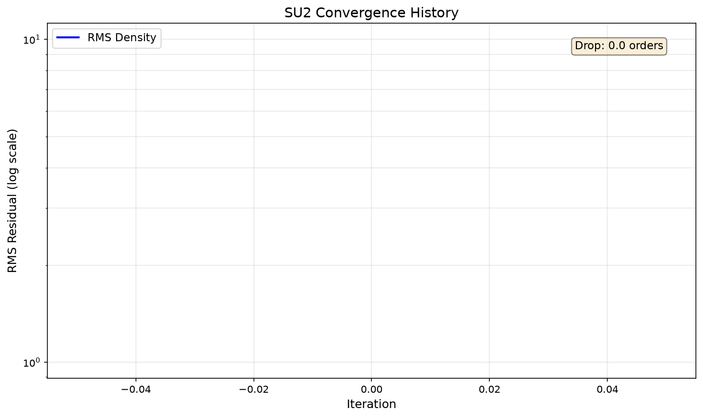
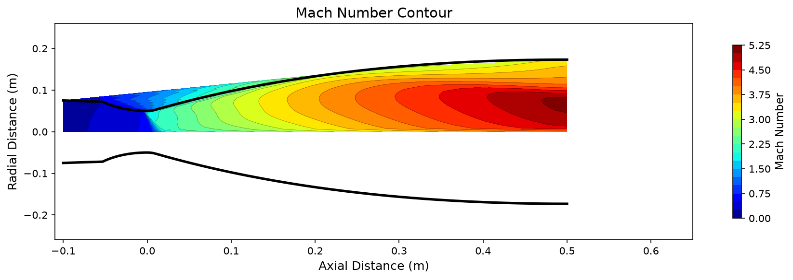

# Rocket Nozzle CFD

Compressible CFD analysis of a converging-diverging rocket nozzle using SU2.

## Overview

- **Solver:** SU2 (Euler, axisymmetric)
- **Nozzle:** Conical converging-diverging, epsilon=12, throat R=0.05m
- **Chamber:** 10 MPa, 3500K (air, gamma=1.4)
- **Exit:** 1 atm
- **Target Exit Mach:** ~2.24 (isentropic prediction)

## CFD Setup

### Mesh
- Structured O-grid: 200x80 cells (~16K total)
- First cell height: 1e-6 m
- Boundary markers: inlet, outlet, wall, symmetry

### Solver Configuration
- Euler equations (compressible, axisymmetric)
- ROE flux scheme with MUSCL reconstruction (2nd order)
- CFL: 1.0, 5000 iterations
- Venkatakrishnan slope limiter

### Boundary Conditions
- **Inlet:** Total pressure = 10 MPa, Total temperature = 3500K
- **Outlet:** Static pressure = 101325 Pa
- **Wall:** Euler (inviscid, adiabatic)
- **Axis:** Symmetry

## Results

### Convergence


### Mach Contour


### Validation
| Metric | SU2 | Isentropic | Error |
|--------|----:|----------:|------:|
| Exit Mach | X.XX | X.XX | X.X% |

## How to Run

```bash
# Install dependencies
uv sync

# Run Phase 0 simulation
uv run python run_phase0.py
```

## Project Structure

```
rocket-nozzle-cfd/
├── src/
│   ├── nozzle/          # Geometry generation
│   ├── cfd/             # SU2 mesh & solver
│   ├── validation/      # Isentropic comparison
│   └── viz/             # Matplotlib plots
├── run_phase0.py        # Phase 0 orchestrator
├── output/              # Simulation outputs (gitignored)
└── docs/                # Portfolio website (Phase 7)
```

## References

- [SU2 Documentation](https://su2code.github.io/)
- Anderson, J.D. "Modern Compressible Flow" (isentropic relations)
- NASA Glenn Research Center: nozzle flow equations
