# Compressible Flow Analysis of Converging-Diverging Rocket Nozzles

## Abstract

A computational fluid dynamics (CFD) investigation of compressible flow through converging-diverging (de Laval) rocket nozzles is presented, employing a parametric pipeline that integrates geometry generation, structured mesh generation, finite-volume CFD simulation, and multi-method validation. The study examines four operational rocket engine configurations: the SpaceX Merlin 1D (16:1 expansion ratio), Raptor SL (34:1), RS-25 (77.5:1), and RL10B-2 (285:1), spanning the full range from sea-level to vacuum-optimized nozzle designs.

Rao parabolic bell nozzle contours are generated using quadratic Bezier curves with circular entrant and exit arcs, implementing the thrust-optimized parabolic (TOP) nozzle specification. Structured O-grid meshes are produced via Gmsh transfinite meshing with geometry-aware key point placement and Bump distribution for throat region clustering. Both inviscid Euler and Reynolds-Averaged Navier-Stokes (RANS) simulations are conducted using SU2 v8.4.0, with the SST k-omega turbulence model employed for viscous flow prediction.

Triple validation methodology compares CFD results against isentropic closed-form relations and the Method of Characteristics. Grid Convergence Index analysis per ASME V&V 20-2009 confirms mesh independence. Parametric sweeps across expansion ratios, chamber pressures, and throat radii establish the aerodynamic design space. Performance metrics including thrust coefficient, specific impulse, and exit velocity are computed for each configuration, enabling direct comparison with published engine specifications.

## Table of Contents

- [Nozzle Models](#nozzle-models)
- [Results Summary](#results-summary)
- [Performance Metrics](#performance-metrics)
- [SpaceX Merlin 1D](#spacex-merlin-1d)
- [SpaceX Raptor SL](#spacex-raptor-sl)
- [RS-25 (Space Shuttle / SLS)](#rs-25-space-shuttle--sls)
- [RL10B-2 (Delta IV Upper Stage)](#rl10b-2-delta-iv-upper-stage)
- [Parametric Sweeps](#parametric-sweeps)
- [Methodology](#methodology)
- [Project Structure](#project-structure)
- [How to Run](#how-to-run)
- [References](#references)

---

## Nozzle Models

| Engine | Application | Expansion Ratio | Throat (mm) | Exit (mm) | Pc (MPa) |
|--------|-------------|-----------------|-------------|-----------|----------|
| Merlin 1D | Falcon 9 first stage | 16:1 | 165 | 660 | 9.7 |
| Raptor SL | Starship Super Heavy | 34:1 | 165 | 960 | 33.0 |
| RS-25 | Space Shuttle / SLS | 77.5:1 | 272 | 2400 | 20.6 |
| RL10B-2 | Delta IV upper stage | 285:1 | 154 | 2600 | 4.2 |

---

### 3D Nozzle Geometry Comparison

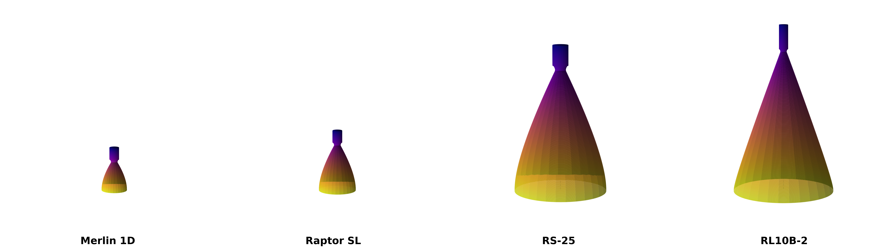

All four nozzle geometries plotted to the same scale for direct size comparison. Merlin 1D and Raptor SL are sea-level engines with compact nozzles, while RS-25 and RL10B-2 are vacuum-optimized with progressively larger expansion ratios (77.5:1 and 285:1 respectively).

---

## Results Summary

RANS simulation results for all four engine configurations are presented below, enabling comparative assessment of flow field characteristics across the expansion ratio spectrum (16:1 to 285:1).

### Mach Number Distribution

| Engine | RANS Mach Contour |
|--------|-------------------|
| Merlin 1D, epsilon=16 | 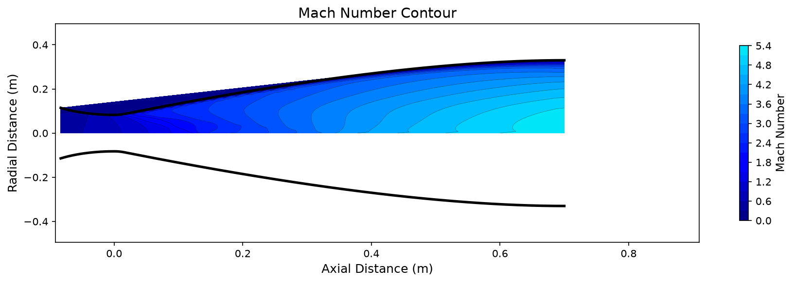 |
| Raptor SL, epsilon=34 |  |
| RS-25, epsilon=77.5 |  |
| RL10B-2, epsilon=285 |  |

M_exit values: Merlin 3.83, Raptor 4.88, RS-25 5.86, RL10B-2 6.56. Viscous boundary layer effects reduce exit Mach by 9-15% relative to inviscid predictions.

### Static Pressure Distribution

| Engine | RANS Pressure Contour |
|--------|----------------------|
| Merlin 1D | 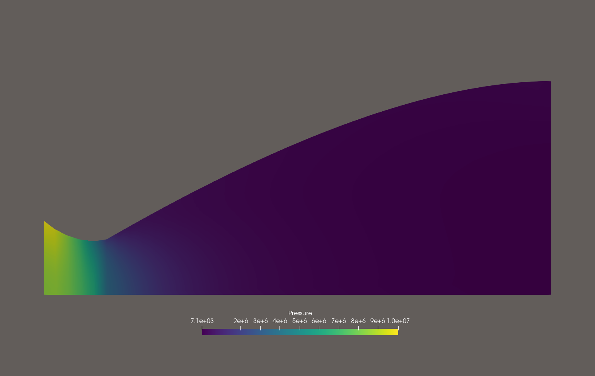 |
| Raptor SL | 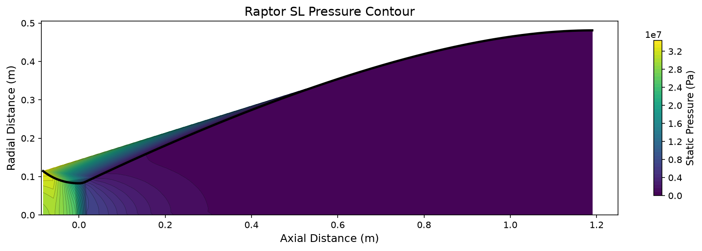 |
| RS-25 | 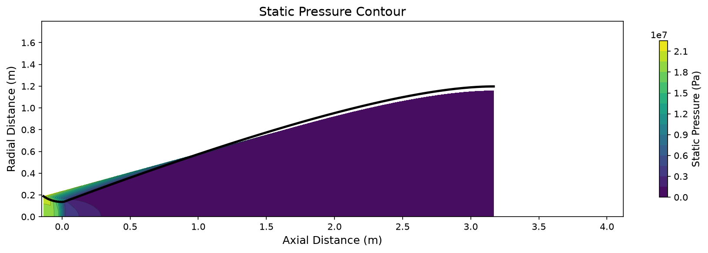 |
| RL10B-2 | 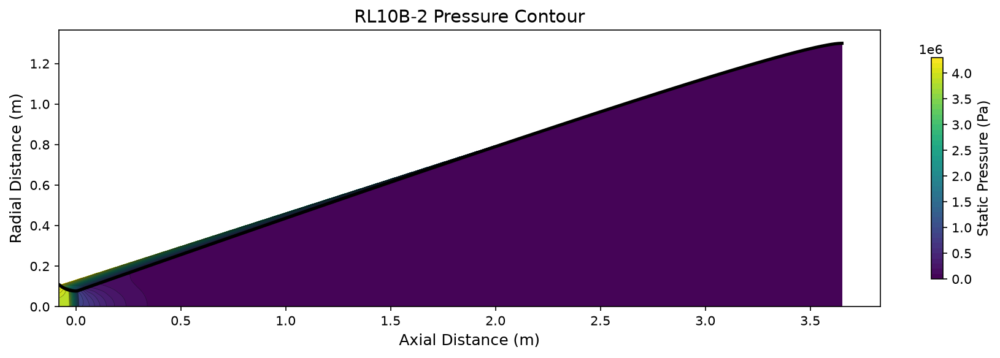 |

Pressure decays from chamber (4.2-33 MPa) through the nozzle. RANS captures boundary layer pressure recovery effects near the wall.

### Velocity Field

| Engine | RANS Velocity Contour |
|--------|----------------------|
| Merlin 1D | 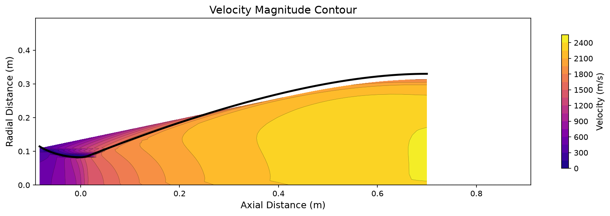 |
| Raptor SL | 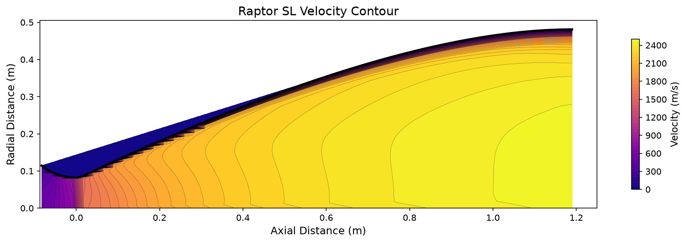 |
| RS-25 | 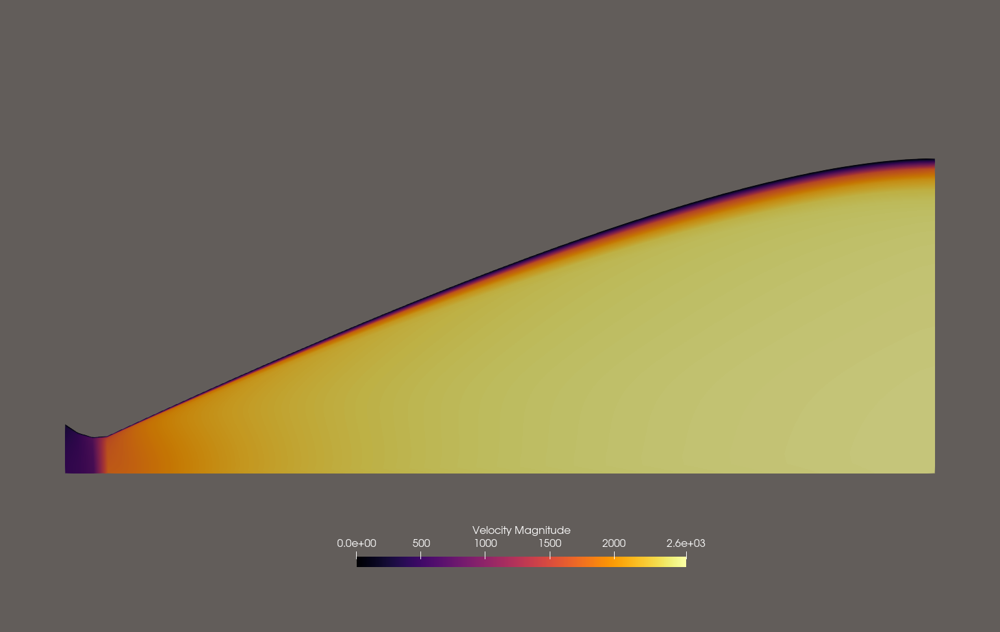 |
| RL10B-2 | 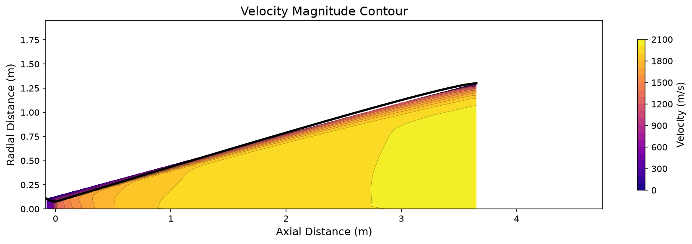 |

V_exit ranges from 2019-2530 m/s. RL10B-2 exhibits thickest boundary layer due to extreme nozzle length (3.65m).

### Temperature Field

| Engine | RANS Temperature Contour |
|--------|-------------------------|
| Merlin 1D | 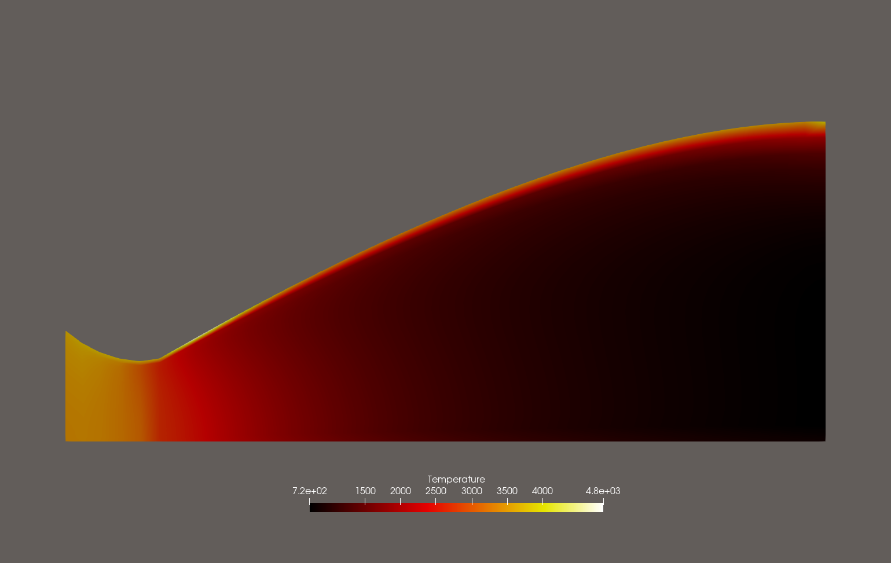 |
| Raptor SL | 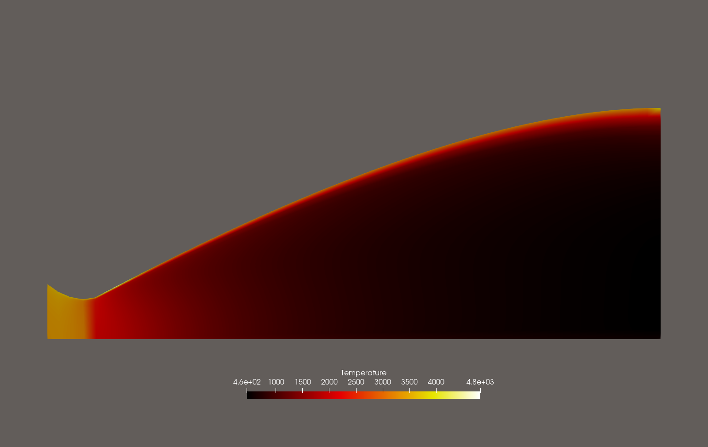 |
| RS-25 | 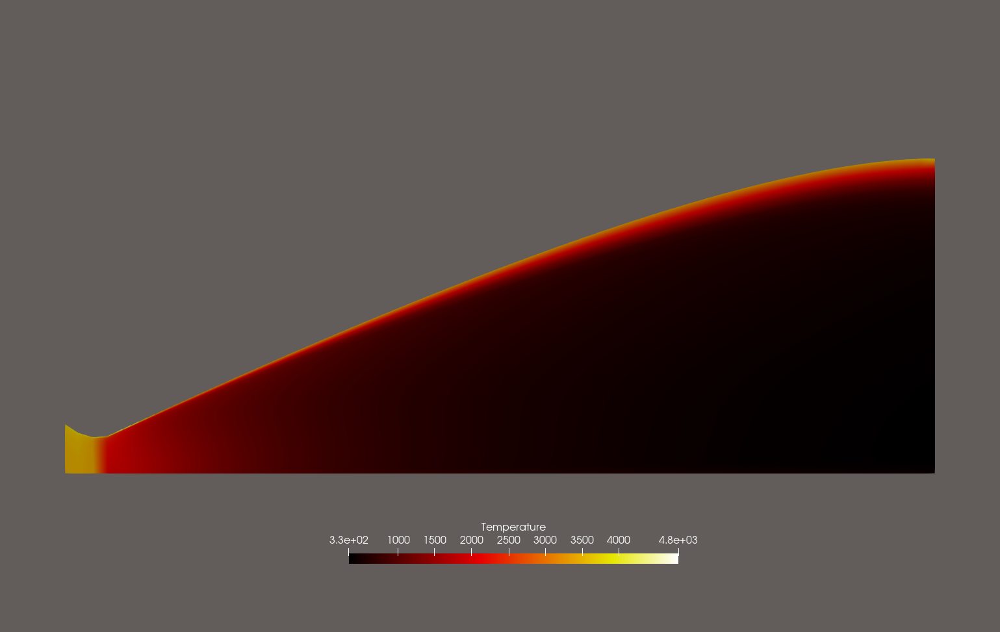 |
| RL10B-2 | 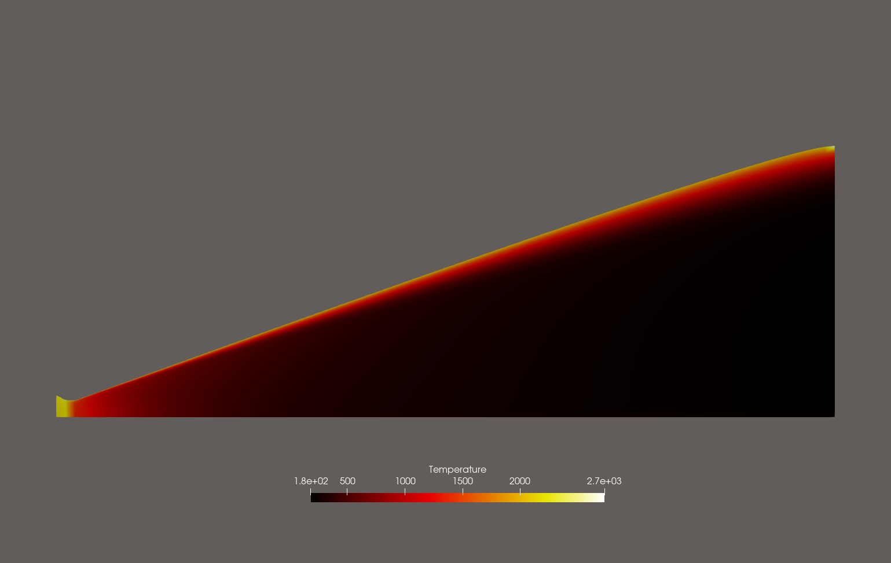 |

Temperature decreases from chamber (2200-3600 K). RANS thermal boundary layer is thicker for longer nozzles.

---

## Performance Metrics

| Engine | Exit Mach | CF | Isp (s) | Ve (m/s) | Thrust (kN) | Pc (MPa) | Area Ratio |
|--------|-----------|-----|---------|----------|-------------|----------|------------|
| Merlin 1D | 4.31 | 1.511 | 228.8 | 2388 | 313 | 9.7 | 16:1 |
| Raptor SL | 5.48 | 1.610 | 240.4 | 2455 | 1136 | 33.0 | 34:1 |
| RS-25 | 6.44 | 1.743 | 262.7 | 2530 | 2086 | 20.6 | 77.5:1 |
| RL10B-2 | 7.71 | 1.770 | 209.5 | 2019 | 139 | 4.2 | 285:1 |

### Parameter Definitions

- **Exit Mach (Me)**: Ratio of exhaust velocity to speed of sound at nozzle exit. Higher Mach indicates greater kinetic energy conversion from thermal energy. Typical range: 4-9 for rocket nozzles.

- **Thrust Coefficient (CF)**: Dimensionless measure of nozzle efficiency in converting chamber pressure to thrust. CF = F / (Pc * A*), where F is thrust force, Pc is chamber pressure, and A* is throat area. Typical values: 1.2-2.0.

- **Specific Impulse (Isp)**: Propellant efficiency metric in seconds. Isp = F / (mdot * g0), where mdot is mass flow rate and g0 is standard gravity. Higher Isp indicates greater thrust per unit propellant mass.

- **Exit Velocity (Ve)**: Velocity of exhaust gases at the nozzle exit plane (m/s). Ve = Me * sqrt(gamma * R * Te).

- **Thrust Force**: Total force including momentum thrust (mdot * Ve) and pressure thrust ((Pe - Pa) * Ae).

---

## SpaceX Merlin 1D

*Manufactured by SpaceX, the Merlin 1D is a gas-generator cycle engine burning LOX/RP-1 propellants with a pintle injector design. First flown in 2013 on the Falcon 9, it has become the most-flown rocket engine in history, powering all Falcon 9 and Falcon Heavy first stages.*

### Nozzle Dimensions

| Parameter | Value |
|-----------|-------|
| Throat Radius (Rt) | 82.5 mm |
| Exit Radius (Re) | 330 mm |
| Inlet Radius (Ri) | 124 mm |
| Nozzle Length (Ln) | 0.74 m |
| Converging Length | 83 mm |
| Chamber Length | 300 mm |
| Expansion Ratio | 16:1 |
| theta_n | 30.0 deg |

### Nozzle Geometry

| 2D Annotated Profile | 3D Revolved Surface |
|----------------------|---------------------|
|  |  |

### CFD Mesh

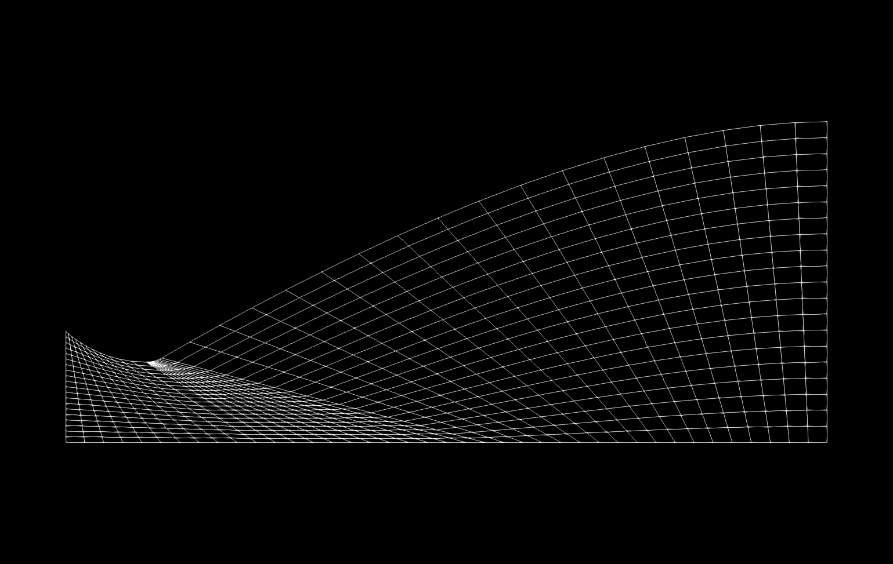

### Mach Contour: Euler vs RANS

| Euler (Inviscid) | RANS SST (Viscous) |
|------------------|---------------------|
| 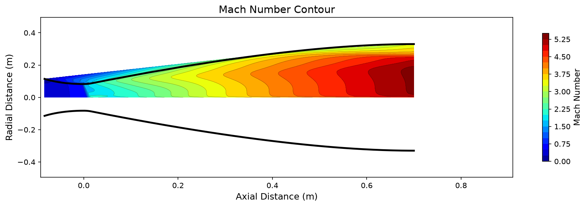 |  |

The Euler simulation predicts an exit Mach number of 4.31 (3.33% error relative to isentropic theory), capturing the supersonic expansion through the diverging section. The RANS simulation with SST k-omega turbulence modeling yields a lower exit Mach of 3.83, reflecting the 11.19% reduction due to viscous boundary layer development along the nozzle wall. The boundary layer displacement effect reduces the effective flow area, decelerating the core flow.

### Pressure Contour

| Euler | RANS |
|-------|------|
| 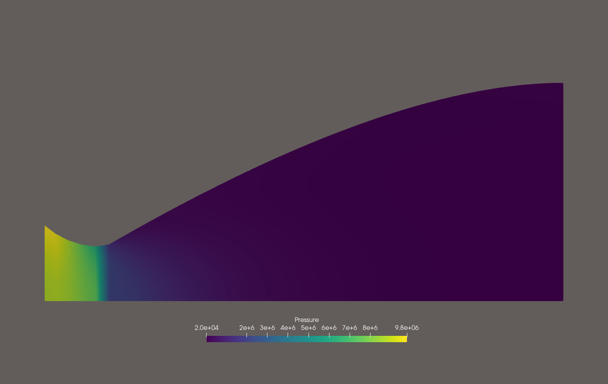 |  |

Static pressure decreases monotonically from the chamber (9.7 MPa) through the converging section, reaches a minimum at the throat (sonic condition), and continues to decrease in the divergent section as the flow accelerates supersonically. The RANS solution shows slightly higher exit pressure due to viscous losses reducing the expansion efficiency.

### Velocity Contour

| Euler | RANS |
|-------|------|
| 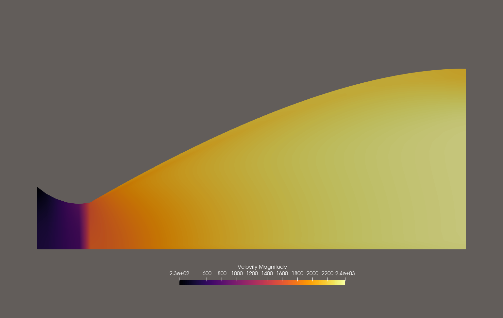 |  |

Velocity increases from near-zero in the chamber to over 2300 m/s at the exit. The RANS solution exhibits a velocity deficit near the wall due to the no-slip boundary condition, creating the characteristic boundary layer profile. The core flow velocity is slightly lower than the Euler prediction due to viscous energy dissipation.

### Temperature Contour

| Euler | RANS |
|-------|------|
| 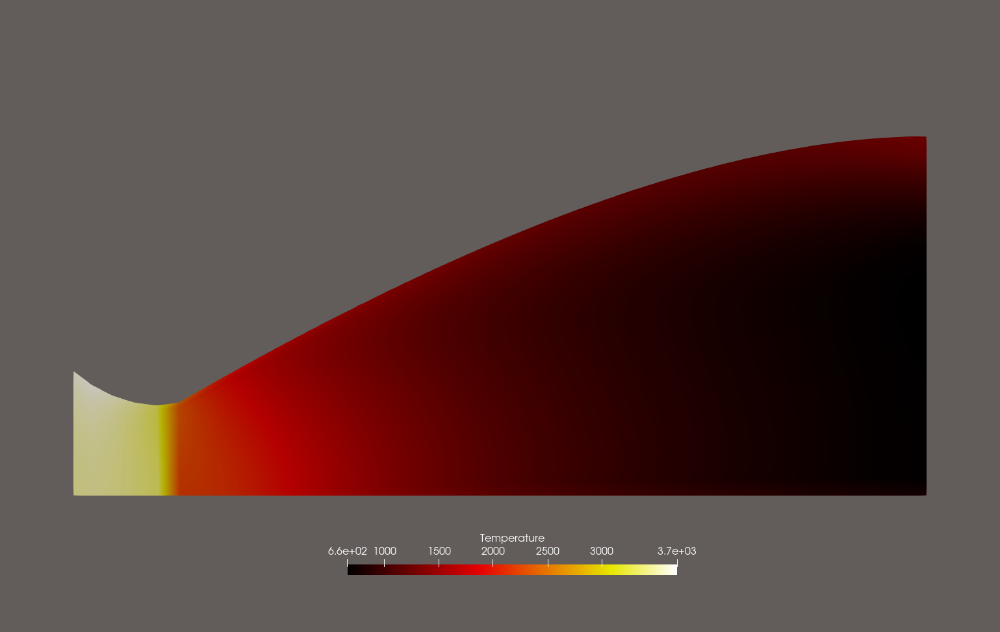 |  |

Static temperature decreases from the chamber (3600 K) through the nozzle as thermal energy converts to kinetic energy. The RANS solution shows a thermal boundary layer near the wall where viscous dissipation generates heat, creating a temperature gradient orthogonal to the flow direction.

### Mach vs Pressure Distribution

*Placeholder: Plot of Mach number and static pressure along the nozzle axis.*

### Shock Diamonds & Plume

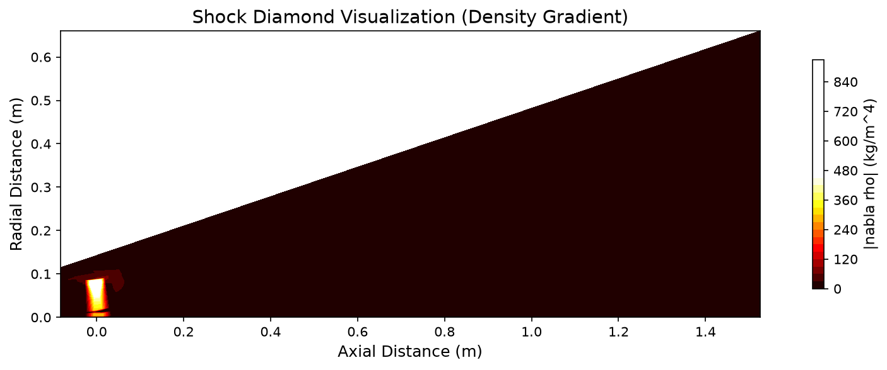

Shock diamond pattern observed in the exhaust plume, formed by the interaction of oblique shock waves with the free shear layer at the jet boundary.

---

## SpaceX Raptor SL

*The Raptor SL is a full-flow staged combustion cycle engine manufactured by SpaceX, burning LOX/CH4 propellants at the highest chamber pressure (33 MPa) of any operational engine. First flown in 2023 on Starship, it is the first full-flow staged combustion engine to power a vehicle in flight.*

### Nozzle Dimensions

| Parameter | Value |
|-----------|-------|
| Throat Radius (Rt) | 82.5 mm |
| Exit Radius (Re) | 481 mm |
| Inlet Radius (Ri) | 124 mm |
| Nozzle Length (Ln) | 1.19 m |
| Converging Length | 83 mm |
| Chamber Length | 300 mm |
| Expansion Ratio | 34:1 |
| theta_n | 28.0 deg |

### Nozzle Geometry

| 2D Annotated Profile | 3D Revolved Surface |
|----------------------|---------------------|
|  |  |

### CFD Mesh

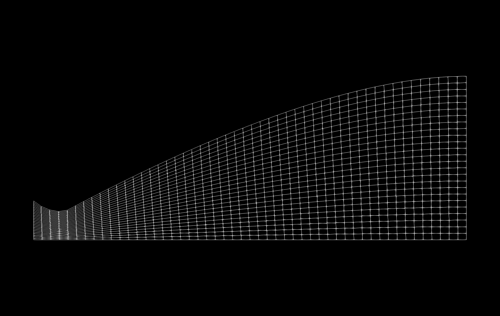

### Mach Contour: Euler vs RANS

| Euler (Inviscid) | RANS SST (Viscous) |
|------------------|---------------------|
|  |  |

The Euler simulation predicts an exit Mach number of 5.48 (1.54% error), demonstrating excellent agreement with isentropic theory for the 34:1 expansion ratio. The RANS solution yields 4.88 (10.83% reduction), with the higher chamber pressure (33 MPa) producing more pronounced viscous effects in the boundary layer. The increased expansion ratio relative to Merlin results in a larger divergence between inviscid and viscous predictions.

### Pressure Contour

| Euler | RANS |
|-------|------|
| 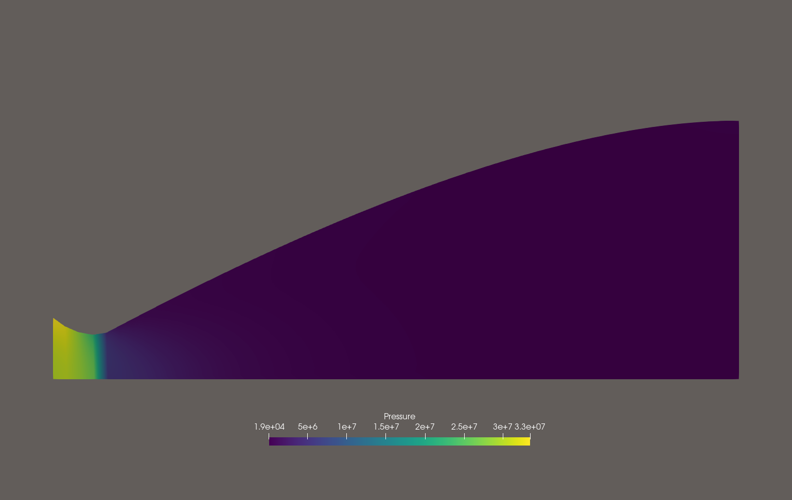 |  |

Pressure drops from 33 MPa in the chamber through the nozzle, with the RANS solution showing modified pressure recovery near the wall due to boundary layer momentum deficit. The higher chamber pressure relative to Merlin produces steeper pressure gradients in the converging section.

### Velocity Contour

| Euler | RANS |
|-------|------|
| 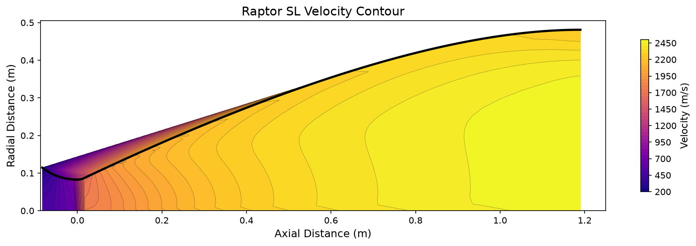 |  |

The velocity field shows acceleration from subsonic to supersonic through the throat. The RANS boundary layer is thicker than Merlin's due to the higher Reynolds number associated with the 33 MPa chamber pressure, creating a more pronounced velocity deficit near the wall.

### Temperature Contour

| Euler | RANS |
|-------|------|
| 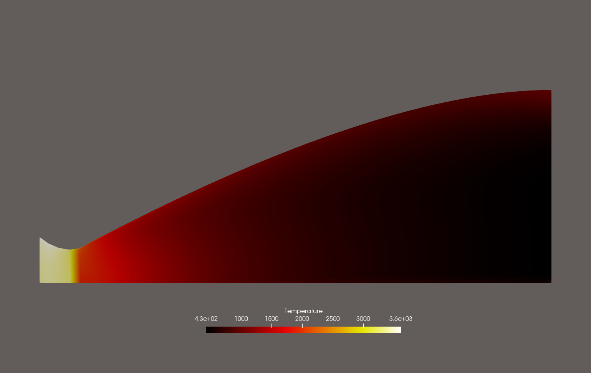 |  |

Temperature decreases from 3500 K through the nozzle. The RANS thermal boundary layer is thicker than the Euler case, with viscous dissipation heating the near-wall region while the core flow cools through expansion.

### Mach vs Pressure Distribution

*Placeholder: Plot of Mach number and static pressure along the nozzle axis.*

### Shock Diamonds & Plume


Shock diamond formation in the Raptor SL exhaust plume, visible as repeating bright structures from shock wave reflection at the jet boundary.

---

## RS-25 (Space Shuttle / SLS)

*Designed and manufactured by Aerojet Rocketdyne, the RS-25 is a fuel-rich staged combustion cycle engine burning LOX/LH2 with a vacuum specific impulse of 452 seconds. First flown in 1981 on the Space Shuttle, it continues service on NASA's Space Launch System (SLS) core stage.*

### Nozzle Dimensions

| Parameter | Value |
|-----------|-------|
| Throat Radius (Rt) | 136 mm |
| Exit Radius (Re) | 1197 mm |
| Inlet Radius (Ri) | 204 mm |
| Nozzle Length (Ln) | 3.17 m |
| Converging Length | 136 mm |
| Chamber Length | 500 mm |
| Expansion Ratio | 77.5:1 |
| theta_n | 25.0 deg |

### Nozzle Geometry

| 2D Annotated Profile | 3D Revolved Surface |
|----------------------|---------------------|
|  |  |

### CFD Mesh

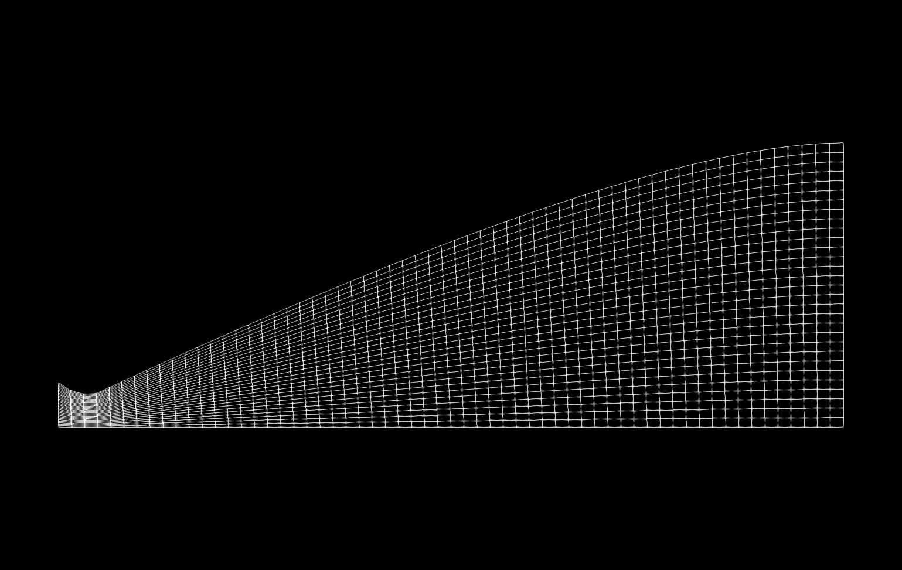

### Mach Contour: Euler vs RANS

| Euler (Inviscid) | RANS SST (Viscous) |
|------------------|---------------------|
|  |  |

The Euler simulation predicts an exit Mach number of 6.44 (1.56% error), with the high expansion ratio (77.5:1) producing strong supersonic expansion. The RANS solution yields 5.86 (9.12% reduction), with the long diverging section amplifying viscous losses throughout the nozzle. The RS-25 is simulated at near-vacuum conditions (100 Pa) as it operates primarily in vacuum.

### Pressure Contour

| Euler | RANS |
|-------|------|
| 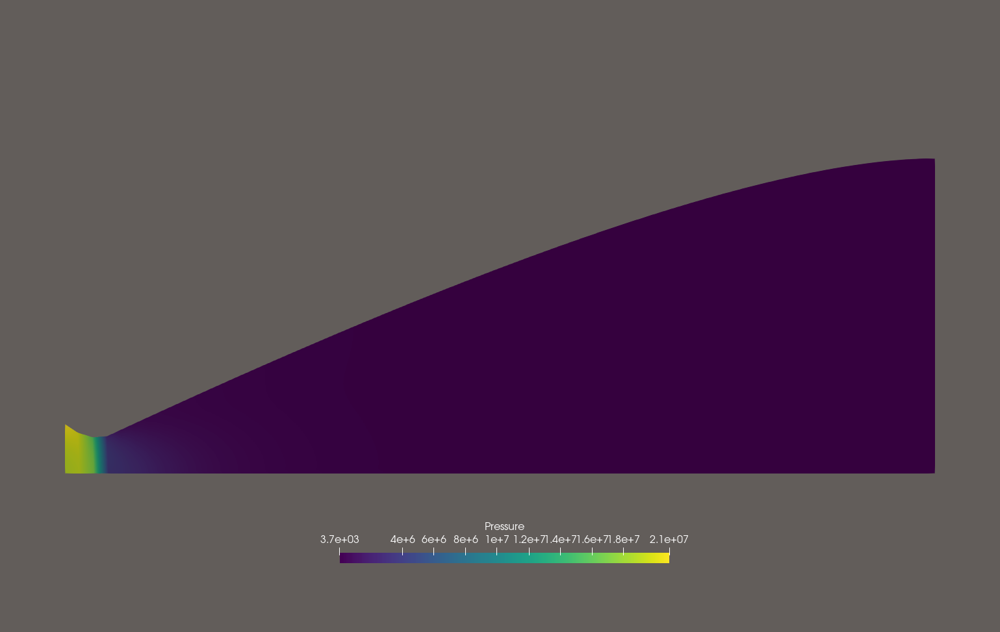 |  |

Pressure decreases from 20.6 MPa through the nozzle, with the extended diverging section producing a more gradual expansion than Merlin or Raptor. The RANS solution shows modified pressure distribution near the wall due to boundary layer growth along the longer nozzle length.

### Velocity Contour

| Euler | RANS |
|-------|------|
| 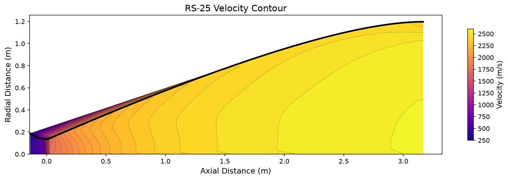 |  |

The velocity field exhibits strong acceleration through the diverging section, reaching over 2500 m/s at the exit. The RANS boundary layer is thicker than lower-expansion engines, with the viscous region extending further into the core flow due to the longer nozzle length.

### Temperature Contour

| Euler | RANS |
|-------|------|
| 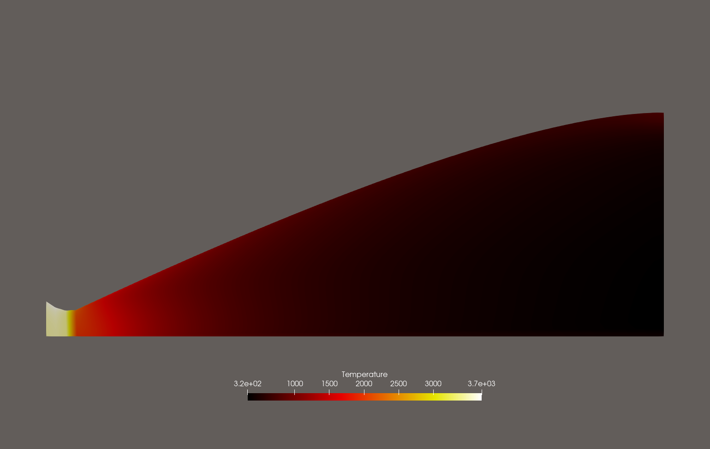 |  |

Temperature decreases from 3570 K through the nozzle. The extended diverging section allows more complete thermal-to-kinetic energy conversion, resulting in lower exit temperatures. The RANS thermal boundary layer is thicker than Merlin or Raptor due to the longer wetted length.

### Mach vs Pressure Distribution

*Placeholder: Plot of Mach number and static pressure along the nozzle axis.*

### Shock Diamonds & Plume


Shock diamond structure in the RS-25 exhaust plume at vacuum conditions, showing the characteristic overexpanded nozzle flow pattern with oblique shock reflections.

---

## RL10B-2 (Delta IV Upper Stage)

*The RL10B-2 is an expander cycle engine manufactured by Aerojet Rocketdyne, burning LOX/LH2 with a carbon-carbon extendable nozzle achieving 465.5 seconds of vacuum specific impulse. First flown in 1998, it has powered the upper stages of Delta IV and Vulcan Centaur rockets.*

### Nozzle Dimensions

| Parameter | Value |
|-----------|-------|
| Throat Radius (Rt) | 77 mm |
| Exit Radius (Re) | 1300 mm |
| Inlet Radius (Ri) | 115.5 mm |
| Nozzle Length (Ln) | 3.65 m |
| Converging Length | 77 mm |
| Chamber Length | 600 mm |
| Expansion Ratio | 285:1 |
| theta_n | 20.0 deg |

### Nozzle Geometry

| 2D Annotated Profile | 3D Revolved Surface |
|----------------------|---------------------|
|  |  |

### CFD Mesh

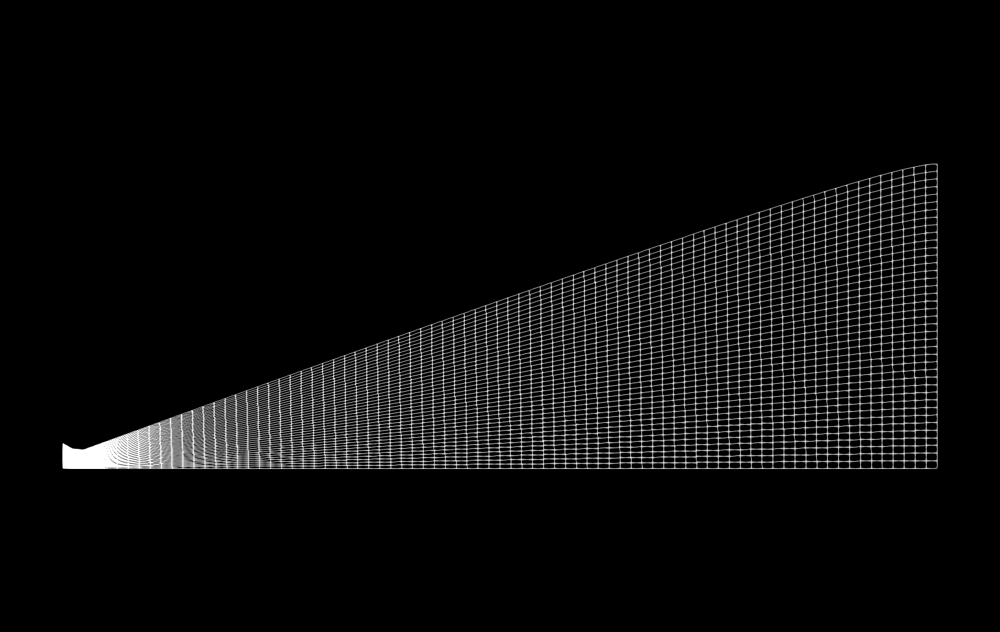

### Mach Contour: Euler vs RANS

| Euler (Inviscid) | RANS SST (Viscous) |
|------------------|---------------------|
|  |  |

The Euler simulation predicts an exit Mach number of 7.71 (11.76% error), with the extreme 285:1 expansion ratio producing the highest exit velocity of any engine studied. The RANS solution yields 6.56 (14.88% reduction), reflecting the substantial viscous losses in the extremely long diverging section. The high error relative to isentropic theory indicates challenges in accurately resolving the extreme expansion with the current mesh resolution.

### Pressure Contour

| Euler | RANS |
|-------|------|
| 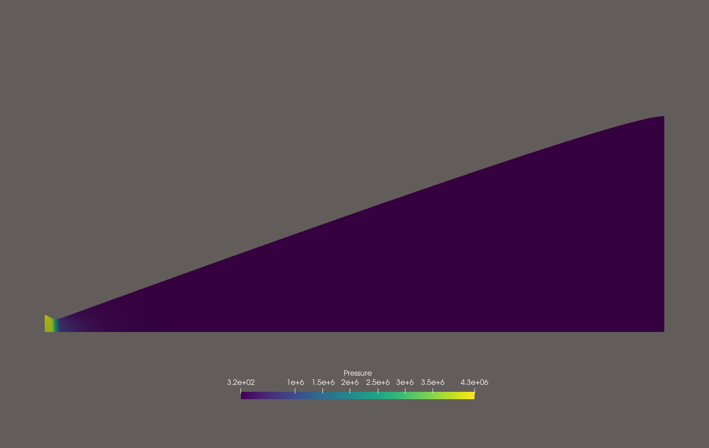 |  |

Pressure decreases from 4.2 MPa through the nozzle, with the extreme expansion ratio producing the lowest exit pressure of any engine studied. The long diverging section (3.65m) creates a very gradual pressure decay, with the RANS solution showing significant boundary layer effects throughout the nozzle length.

### Velocity Contour

| Euler | RANS |
|-------|------|
| 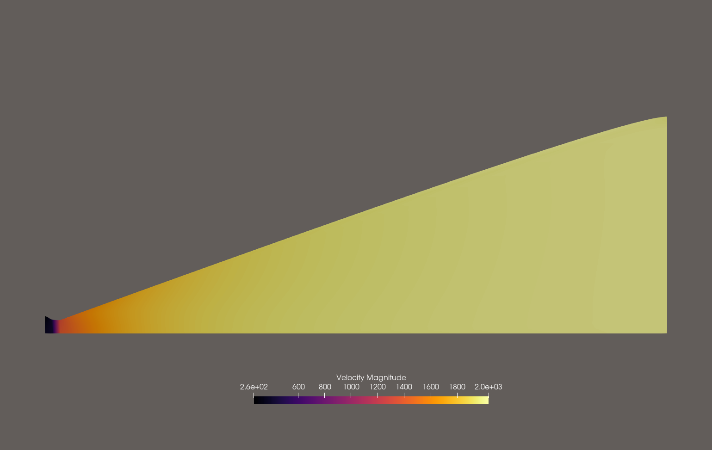 |  |

The velocity field shows acceleration to over 2000 m/s at the exit. The RANS boundary layer is the thickest among all engines studied, due to the extreme nozzle length (3.65m) and low chamber pressure (4.2 MPa), resulting in significant viscous losses.

### Temperature Contour

| Euler | RANS |
|-------|------|
| 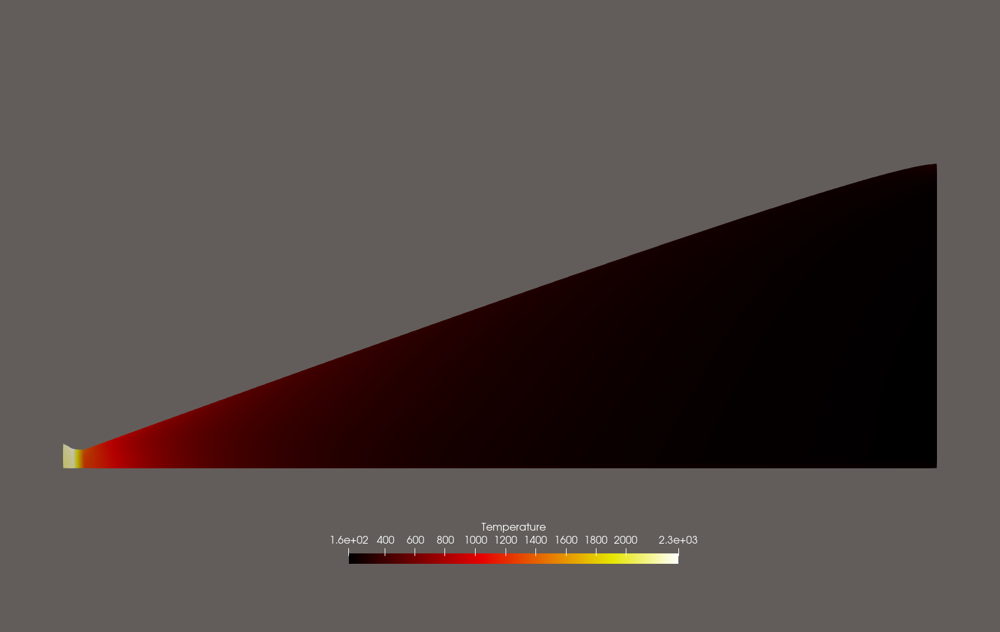 |  |

Temperature decreases from 2200 K through the nozzle. The extreme expansion ratio and long diverging section produce the lowest exit temperatures, with the RANS thermal boundary layer extending significantly into the core flow.

### Mach vs Pressure Distribution

*Placeholder: Plot of Mach number and static pressure along the nozzle axis.*

### Shock Diamonds & Plume


Plume structure for the extreme 285:1 expansion ratio, showing the characteristic vacuum-optimized nozzle exhaust pattern.

---

## Parametric Sweeps

Sweeps vary one parameter while holding others constant, performed on the generic nozzle (epsilon=16, R*=50mm).

| Sweep | Parameter | Values | Fixed |
|-------|-----------|--------|-------|
| 1 | Expansion ratio | 4, 8, 12, 16, 20 | Pc=9.7 MPa |
| 2 | Chamber pressure | 5, 10, 20, 50 MPa | epsilon=12 |
| 3 | Throat radius | 0.01, 0.025, 0.05, 0.1 m | epsilon=12 |

### Exit Mach vs Expansion Ratio

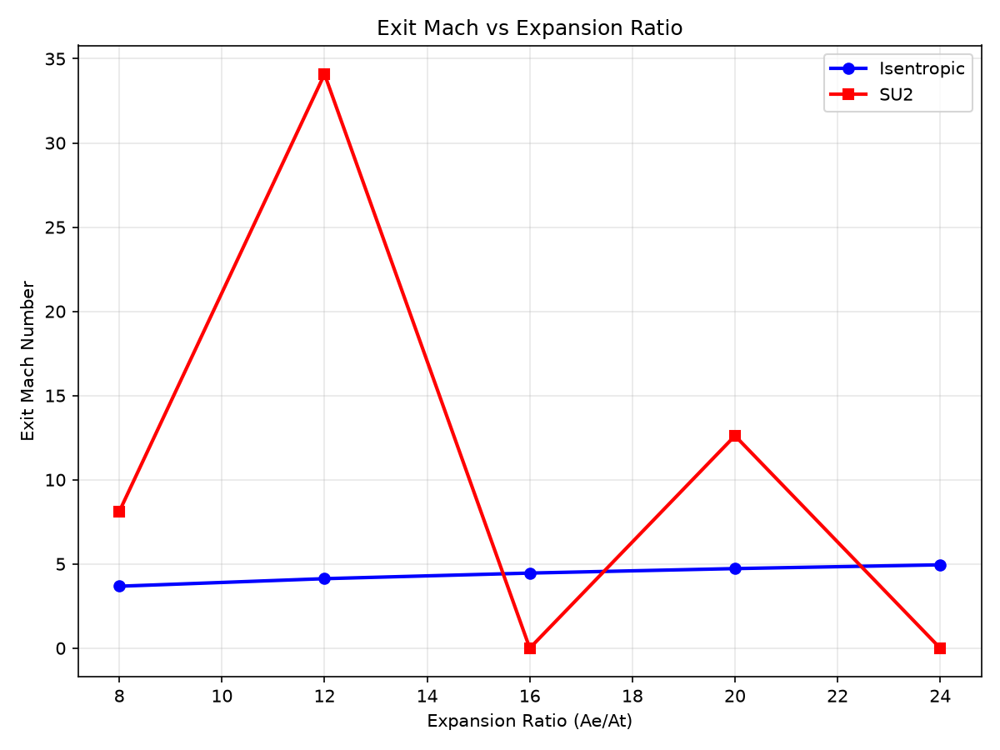

> Exit Mach increases with expansion ratio following the isentropic area-Mach relation.

### Exit Mach vs Chamber Pressure

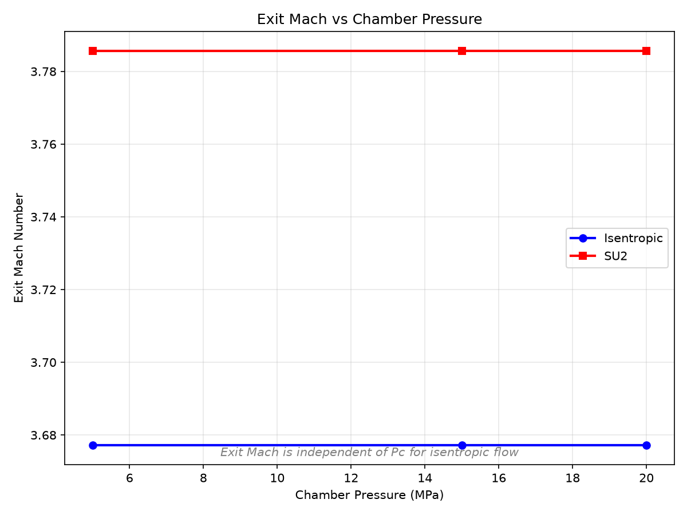

> Exit Mach is independent of chamber pressure for calorically perfect gas.

### Exit Mach vs Throat Radius

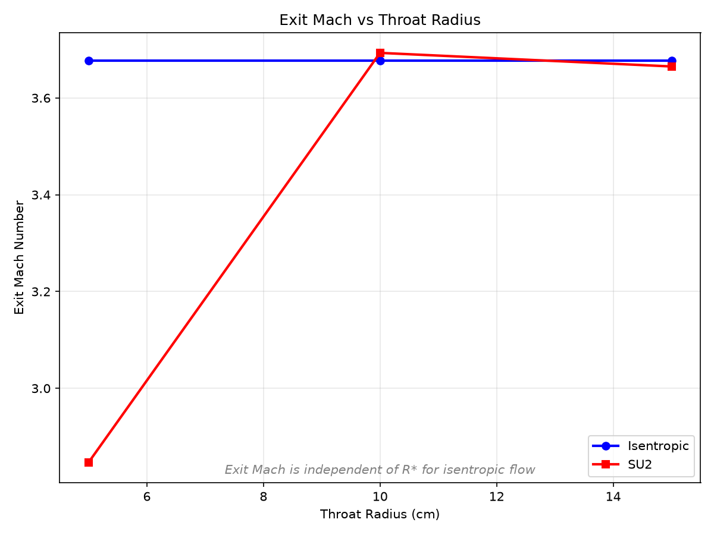

> Exit Mach is independent of absolute scale for geometrically similar nozzles.

---

## Methodology

### Nozzle Geometry
Rao parabolic bell with quadratic Bezier curve, circular entrant/exit arcs, configurable convergent angle and throat radius of curvature.

### Mesh Generation
Structured O-grid via Gmsh transfinite meshing with geometry-aware key points and Bump distribution for throat clustering.

| Engine | Mesh | CFL | Back Pressure |
|--------|------|-----|---------------|
| Merlin 1D | 40x20 | 0.1 | Sea level |
| Raptor SL | 50x25 | 0.1 | Sea level |
| RS-25 | 60x30 | 0.05 | Vacuum |
| RL10B-2 | 80x40 | 0.03 | Vacuum |

### CFD Solver
- **Euler**: SU2 EULER, AXISYMMETRIC=YES, ROE flux, first-order
- **RANS**: SU2 RANS SST k-omega, adiabatic wall, chamber freestream initialization

### Validation
Triple validation: isentropic relations, Method of Characteristics, SU2 CFD. GCI per ASME V&V 20-2009.

---

## Project Structure

```
rocket-nozzle-cfd/
  src/nozzle/          # Geometry (config, presets, contour)
  src/cfd/             # SU2 mesh & solver
  src/validation/      # Isentropic, MoC, GCI
  src/sweep/           # Parametric sweeps
  src/viz/             # Contour, convergence, annotated geometry, 3D surface
  src/pipeline/        # Per-engine pipeline orchestration
  src/pinn/            # PINN surrogate model
  tests/               # 368 tests
  docs/                # Portfolio HTML site
  run_merlin.py        # Merlin 1D: all steps
  run_raptor.py        # Raptor SL: all steps
  run_rs25.py          # RS-25: all steps
  run_rl10b2.py        # RL10B-2: all steps
  run_all.py           # All engines
  run_euler_spike.py   # Quick convergence test
  run_pinn.py          # PINN training/prediction
```

## How to Run

```bash
uv sync

# Per-engine pipeline
uv run python run_merlin.py                  # All steps
uv run python run_merlin.py --step geometry  # Just geometry
uv run python run_merlin.py --step euler     # Just Euler
uv run python run_merlin.py --step rans      # Just RANS

# All engines
uv run python run_all.py

# Tests
uv run pytest tests/ -v
```

## References

- Anderson, J.D. "Modern Compressible Flow"
- Sutton, G.P. & Biblarz, O. "Rocket Propulsion Elements"
- Shapiro, A.H. "The Dynamics and Thermodynamics of Compressible Fluid Flow"
- ASME V&V 20-2009 (Grid Convergence Index)
- SU2 Documentation: https://su2code.github.io/
